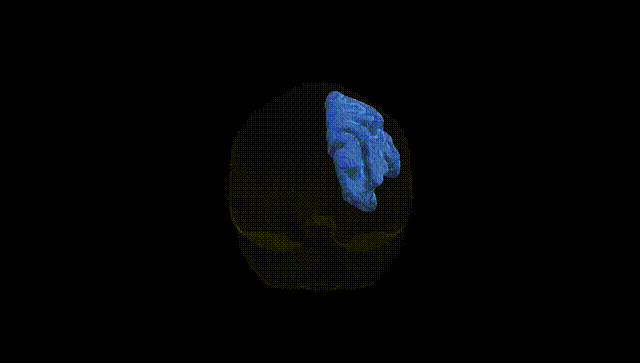
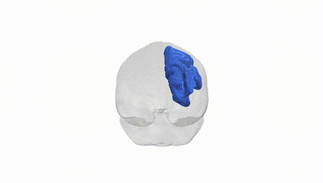
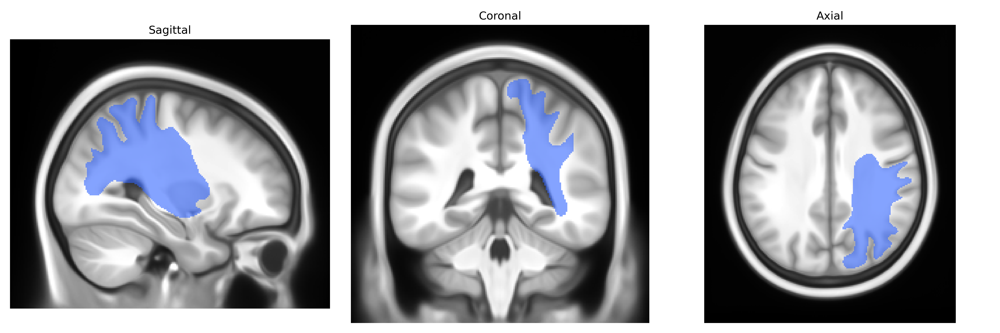

# Striato-parietal right

## Overview

The Striato-parietal right white matter tract, as defined in the Pandora-TractSeg Atlas, is a long association pathway connecting components of the dorsal striatum (primarily the caudate nucleus and putamen) with regions of the posterior parietal cortex in the right hemisphere. This tract carries frontostriatal and parietostriatal signals involved in the integration of sensorimotor, attentional, and higher-order cognitive processes, linking basal ganglia output with parietal areas that support spatial representation, visuomotor coordination, and action planning. Functionally, it contributes to cortico–basal ganglia–thalamo–cortical loops by allowing striatal processing of cortical input and the subsequent modulation of parietal activity, thus influencing motor selection, motor learning, and aspects of goal-directed behavior. There is no direct link for this specific tract; a closely related structure is the [Basal ganglia](https://en.wikipedia.org/wiki/Basal_ganglia).

As of 2024, there are no tract-specific genetic association studies published that explicitly target the “Striato-parietal right” white matter tract as defined in the Pandora-TractSeg Atlas, and genetic findings for this exact tract should be considered largely unknown. Most relevant information comes from large diffusion MRI GWAS that examine global or lobar measures, or broad classes of association fibers, rather than this specific striato-parietal pathway. These studies repeatedly implicate common variants in genes involved in axonal guidance, myelination, and neurodevelopment (for example, loci near or within PAX6, NTRK1/2, NCAM1, and various myelin-related genes) as influencing fractional anisotropy and mean diffusivity across fronto-parietal and cortico-striatal networks, and such effects plausibly extend to striato-parietal projections. Genome-wide significant associations between diffusion metrics and polygenic risk for schizophrenia, bipolar disorder, major depression, ADHD, and cognitive traits (intelligence, educational attainment) have been reported, but these are typically summarized at the level of major tracts (e.g., superior longitudinal fasciculus, corticospinal tract, anterior thalamic radiation) or global white matter factors rather than a Pandora-defined striato-parietal tract. Consequently, any genetic or disorder-related inferences for the Striato-parietal right tract must currently be extrapolated from broader findings on cortico-striatal/parietal connectivity, not from direct tract-specific GWAS evidence.

*Overview generated by GPT-4o (2026).*

---

**Region ID:** 47  
**Hemisphere:** right  
**Atlas:** Pandora-TractSeg 

---

## Striato-parietal right – Black Background (Full Brain)

**Full Quality Version:** <a href="full_black.mp4" download>Download MP4</a>

---

## Striato-parietal right – White Background (Full Brain)

**Full Quality Version:** <a href="full_white.mp4" download>Download MP4</a>

---

## Triplanar View – T1 Background

---

## Triplanar View – Ghost Brain


