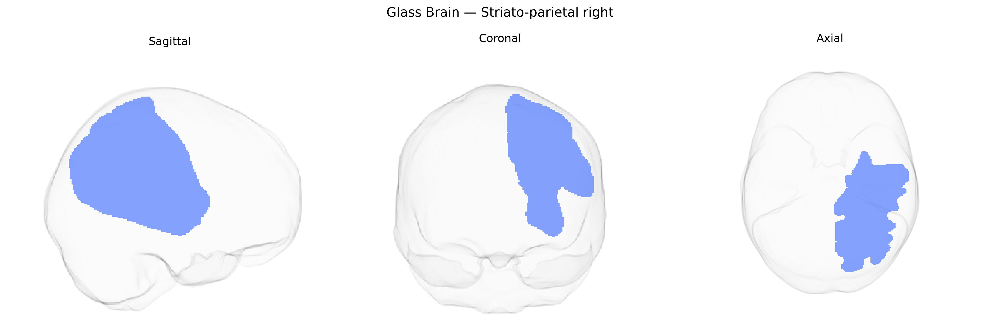

# Striato-parietal right

## Overview

The right striato-parietal tract (right striato-parietal functional group) in the Pandora-TractSeg Atlas refers to a set of white matter connections linking the striatum—primarily components of the basal ganglia such as the caudate nucleus and putamen—to regions of the right parietal cortex. Biologically, this tract participates in cortico-striatal circuits that integrate sensorimotor, spatial, and attentional information, supporting functions such as visuospatial processing, action selection, and the modulation of goal-directed behavior. Through reciprocal connections with parietal association areas, the right striato-parietal pathway contributes to the transformation of sensory information into context-appropriate motor and cognitive responses and is implicated in the neural substrates of attention, working memory, and higher-order motor planning. There is no direct Wikipedia entry for the “right striato-parietal” tract as defined in the Pandora-TractSeg Atlas; a related structure and functional context can be found in the article on the basal ganglia: https://en.wikipedia.org/wiki/Basal_ganglia.

*Overview generated by GPT-4o (2026).*

---

**Region ID:** 47  
**Hemisphere:** right  
**Atlas:** Pandora-TractSeg 

---

## Striato-parietal right – Black Background (Full Brain)

**Full Quality Version:** [Download MP4](full_black.mp4)

---

## Striato-parietal right – White Background (Full Brain)

**Full Quality Version:** [Download MP4](full_white.mp4)

---

## Striato-parietal right – Black Background (Hemisphere)

**Full Quality Version:** [Download MP4](hemi_black.mp4)

---

## Striato-parietal right – White Background (Hemisphere)

**Full Quality Version:** [Download MP4](hemi_white.mp4)

---

## Triplanar View – T1 Background

---

## Triplanar View – Ghost Brain


