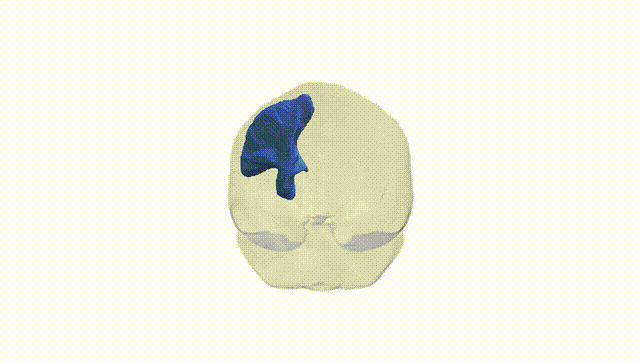
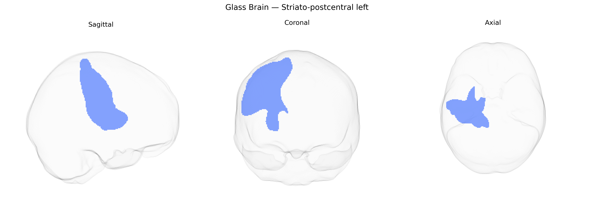

# Striato-postcentral left

## Overview

The Striato-postcentral left white matter tract, as defined in the Pandora-TractSeg Atlas, is a cortico-subcortical associative pathway linking the striatum (a major component of the basal ganglia involved in motor control, action selection, and aspects of cognition and reward processing) with the postcentral gyrus of the left hemisphere, which contains the primary somatosensory cortex responsible for processing tactile, proprioceptive, and nociceptive information from the contralateral side of the body. This tract likely carries integrated sensorimotor and modulatory signals, supporting the coordination between somatosensory input and basal ganglia circuits that shape motor output, sensorimotor learning, and possibly habit formation. There is no direct link for this tract; a related structure is the [Basal ganglia](https://en.wikipedia.org/wiki/Basal_ganglia).

As of current literature, there are no tract-specific genetic association studies that isolate the “Striato-postcentral left” white matter pathway from the Pandora-TractSeg Atlas as a distinct phenotype, so direct GWAS findings for this exact tract are lacking; instead, relevant evidence comes from broader imaging-genetics work on cortico-striatal and sensorimotor white matter and on atlas-wide diffusion MRI measures. Large-scale GWAS of diffusion tensor imaging traits (e.g., UK Biobank–based studies by Zhao et al., 2019; Elliott et al., 2018; Smith et al., 2021) show that fractional anisotropy, mean diffusivity, and related measures in subcortical–sensorimotor projection fibers are heritable and associated with common variants in genes involved in axon guidance, myelination, and oligodendrocyte function (such as variants near or in genes like MAG, MAL, and other myelin-related loci), but these analyses typically aggregate across major projection systems rather than distinguishing the specific striato-postcentral bundle defined in Pandora-TractSeg. Genetic correlations have been reported between diffusion measures in basal ganglia and sensorimotor tracts and neuropsychiatric or neurodevelopmental disorders (e.g., schizophrenia, ADHD, and Parkinson’s disease) and traits such as cognitive performance and motor function, implying that similar pathways may be involved, yet these results cannot be confidently assigned to the Striato-postcentral left tract as labeled in that atlas. Overall, the genetic architecture of diffusion properties in cortico-striatal and sensorimotor white matter is increasingly characterized at a global or tract-class level, but tract-specific GWAS evidence for the Striato-postcentral left tract itself is currently minimal and should be regarded as largely unknown.

*Overview generated by GPT-4o (2026).*

---

**Region ID:** 48  
**Hemisphere:** left  
**Atlas:** Pandora-TractSeg 

---

## Striato-postcentral left – Black Background (Full Brain)

**Full Quality Version:** <a href="full_black.mp4" download>Download MP4</a>

---

## Striato-postcentral left – White Background (Full Brain)

**Full Quality Version:** <a href="full_white.mp4" download>Download MP4</a>

---

## Triplanar View – T1 Background

---

## Triplanar View – Ghost Brain


