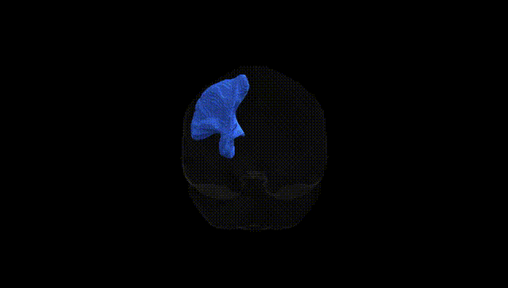
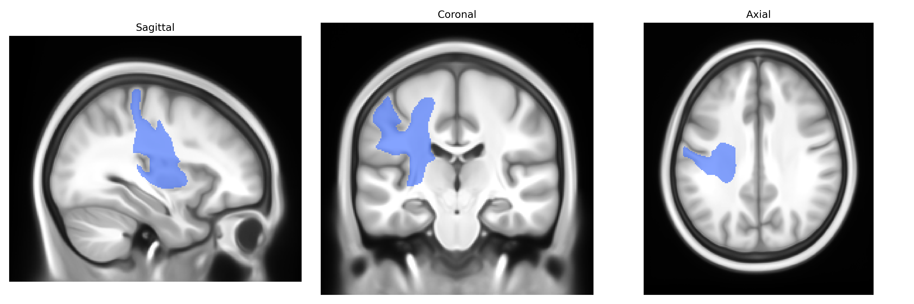

# Striato-postcentral left

## Overview

The left Striato-postcentral region in the Pandora-TractSeg atlas refers to a cortico-subcortical projection system linking the striatum (primarily the caudate nucleus and putamen) with the postcentral gyrus of the left hemisphere, which is the primary somatosensory cortex. This tract participates in integrating somatosensory information (e.g., touch, proprioception) with basal ganglia circuits involved in sensorimotor processing, action selection, and modulation of movement. Functionally, striato-postcentral pathways contribute to the refinement of motor responses based on sensory feedback and are implicated in sensorimotor learning and the automation of skilled movements. These projections form part of the broader basal ganglia–thalamo–cortical loops, in which the striatum serves as a major input structure receiving convergent cortical information, including from primary and secondary somatosensory areas. There is no direct Wikipedia page for the “Striato-postcentral” tract; a related structure and functional context can be found at: https://en.wikipedia.org/wiki/Striatum

*Overview generated by GPT-4o (2026).*

---

**Region ID:** 48  
**Hemisphere:** left  
**Atlas:** Pandora-TractSeg 

---

## Striato-postcentral left – Black Background (Full Brain)

**Full Quality Version:** [Download MP4](full_black.mp4)

---

## Striato-postcentral left – White Background (Full Brain)

**Full Quality Version:** [Download MP4](full_white.mp4)

---

## Striato-postcentral left – Black Background (Hemisphere)

**Full Quality Version:** [Download MP4](hemi_black.mp4)

---

## Striato-postcentral left – White Background (Hemisphere)

**Full Quality Version:** [Download MP4](hemi_white.mp4)

---

## Triplanar View – T1 Background

---

## Triplanar View – Ghost Brain


