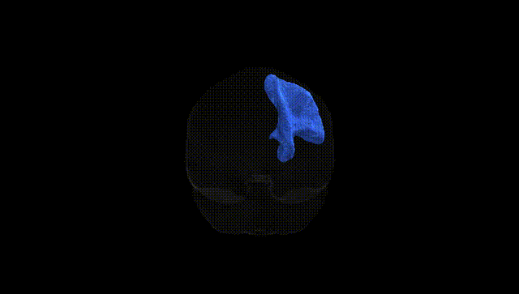
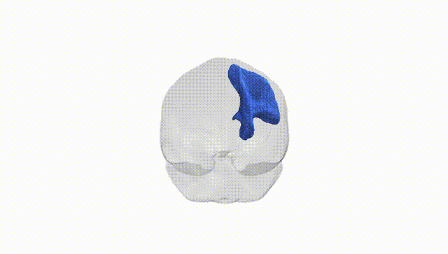
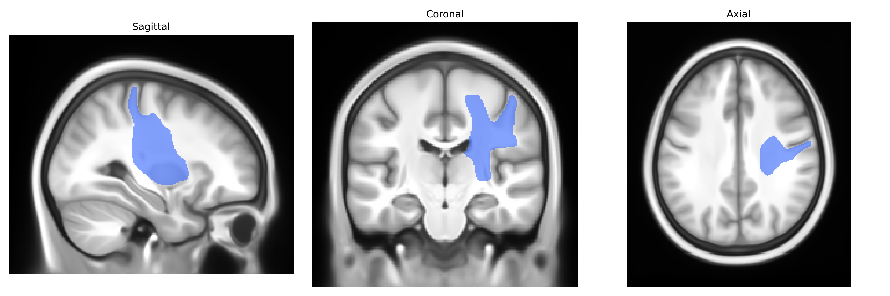
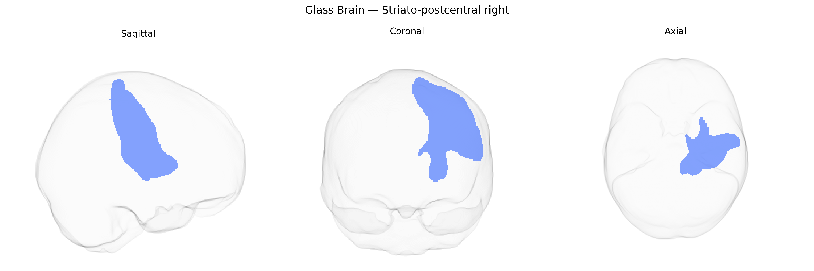

# Striato-postcentral right

## Overview

The Striato-postcentral right white matter tract, as defined in the Pandora-TractSeg Atlas, is a right-hemispheric association pathway connecting regions of the striatum (primarily components of the basal ganglia such as the putamen and caudate) with the postcentral gyrus, which is the primary somatosensory cortex. This tract is thought to mediate integration between subcortical sensorimotor and cognitive processing within the striatum and cortical representations of somatic sensation in the parietal lobe, contributing to functions such as sensorimotor coordination, somatosensory modulation, and potentially aspects of motor learning and habit formation. There is no direct Wikipedia page for this specific tract; a related structure is the [Postcentral gyrus](https://en.wikipedia.org/wiki/Postcentral_gyrus).

As of current literature, there are no tract-specific genetic association studies that explicitly isolate the “Striato-postcentral right” white matter tract as defined in the Pandora-TractSeg Atlas, and thus no well-established GWAS findings or disorder associations uniquely attributed to this tract. Most genetic work on diffusion MRI measures such as fractional anisotropy (FA) and mean diffusivity (MD) has focused on larger or more canonical tracts (e.g., corticospinal tract, corpus callosum, cingulum, superior longitudinal fasciculus) or on global or lobar white matter measures. Large imaging-genetics consortia (such as ENIGMA and UK Biobank–based studies) have identified numerous SNPs and genes influencing FA/MD in sensorimotor and striatal–cortical pathways broadly (e.g., loci near genes involved in axon guidance, myelination, and neuronal development), and these pathways include regions anatomically adjacent to or overlapping with cortico-striatal and postcentral/somatosensory projections. However, these findings are reported at the level of broader regions, principal components, or standard tracts, rather than the specific Striato-postcentral right bundle; consequently, any genetic or disorder-related inferences for this atlas-defined tract remain indirect and extrapolated rather than empirically demonstrated.

*Overview generated by GPT-4o (2026).*

---

**Region ID:** 49  
**Hemisphere:** right  
**Atlas:** Pandora-TractSeg 

---

## Striato-postcentral right – Black Background (Full Brain)

**Full Quality Version:** <a href="full_black.mp4" download>Download MP4</a>

---

## Striato-postcentral right – White Background (Full Brain)

**Full Quality Version:** <a href="full_white.mp4" download>Download MP4</a>

---

## Triplanar View – T1 Background

---

## Triplanar View – Ghost Brain


