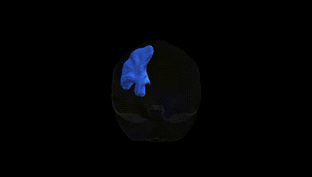
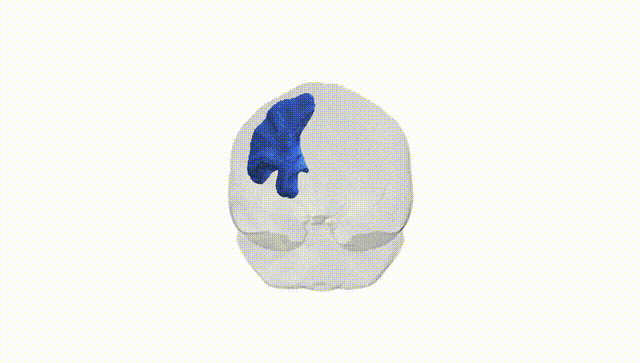

# Striato-precentral left

## Overview

The Striato-precentral left white matter tract, as defined in the Pandora-TractSeg Atlas, is a cortico-striatal projection pathway connecting the striatum (primarily the putamen and caudate nucleus) with the precentral gyrus, the primary motor cortex of the frontal lobe. This tract conveys motor-related information from cortical motor areas to basal ganglia circuits, where it contributes to the selection, initiation, and modulation of voluntary movements, as well as motor learning and habit formation. As a left-hemisphere structure, it is often implicated in dominant-hemisphere motor control, including fine motor coordination of the contralateral (right) side of the body. Disruption or degeneration of this pathway can be associated with movement disorders, such as Parkinson’s disease and dystonia, in which cortico-basal ganglia loops are compromised. There is no direct link for this specific tract; a related structure is the [Basal ganglia](https://en.wikipedia.org/wiki/Basal_ganglia).

As of 2024, there are no tract-specific genetic association studies that isolate the Striato-precentral left white matter pathway from the Pandora-TractSeg Atlas, and thus no well-established GWAS findings uniquely assigned to this tract. Large diffusion MRI GWAS meta-analyses (e.g., UK Biobank–based studies) have identified hundreds of loci associated with global and regional white-matter microstructure (fractional anisotropy, mean diffusivity, and related metrics) in cortico-striatal and motor-related pathways more broadly, implicating genes involved in neurodevelopment, axon guidance, myelination, and synaptic function, and overlapping genetically with disorders such as schizophrenia, major depression, ADHD, and Parkinson’s disease, as well as cognitive and motor traits. However, these findings are typically reported at the level of major tracts (e.g., corticospinal tract, anterior limb of the internal capsule, superior longitudinal fasciculus) or whole-brain diffusion factors, not at the level of fine-grained, atlas-specific connections like the Striato-precentral tract. Consequently, any genetic inferences about this specific Pandora-TractSeg tract must be extrapolated from broader cortico-striatal and motor-system white-matter GWAS and remain indirect.

*Overview generated by GPT-4o (2026).*

---

**Region ID:** 50  
**Hemisphere:** left  
**Atlas:** Pandora-TractSeg 

---

## Striato-precentral left – Black Background (Full Brain)

**Full Quality Version:** <a href="full_black.mp4" download>Download MP4</a>

---

## Striato-precentral left – White Background (Full Brain)

**Full Quality Version:** <a href="full_white.mp4" download>Download MP4</a>

---

## Triplanar View – T1 Background

---

## Triplanar View – Ghost Brain


