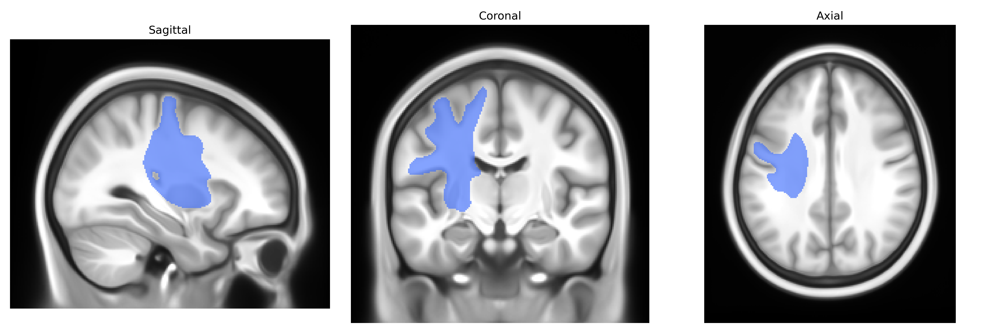
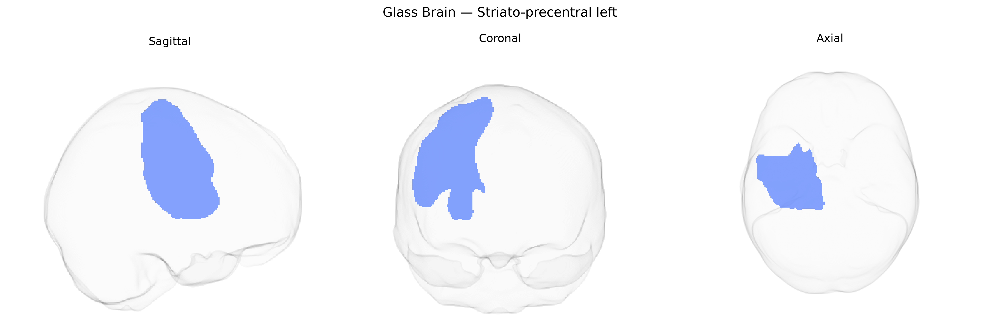

# Striato-precentral left

## Overview

The left Striato-precentral region in the Pandora-TractSeg atlas refers to a white-matter tract or functional connection between the left striatum (primarily the caudate nucleus and putamen) and the left precentral gyrus, the primary motor cortex (M1). This pathway is involved in cortico-striatal motor circuits that integrate motor planning, action selection, and execution, forming part of the basal ganglia–thalamocortical loops that modulate voluntary movement, habit formation, and aspects of motor learning. Neurons from the precentral cortex project to the striatum, where information is processed through direct and indirect pathways and then relayed back to motor cortical areas via the thalamus, enabling fine control and sequencing of movements. There is no direct Wikipedia link for “left Striato-precentral” as a named tract; a related structure is the precentral gyrus: https://en.wikipedia.org/wiki/Precentral_gyrus

*Overview generated by GPT-4o (2026).*

---

**Region ID:** 50  
**Hemisphere:** left  
**Atlas:** Pandora-TractSeg 

---

## Striato-precentral left – Black Background (Full Brain)

**Full Quality Version:** [Download MP4](full_black.mp4)

---

## Striato-precentral left – White Background (Full Brain)

**Full Quality Version:** [Download MP4](full_white.mp4)

---

## Striato-precentral left – Black Background (Hemisphere)

**Full Quality Version:** [Download MP4](hemi_black.mp4)

---

## Striato-precentral left – White Background (Hemisphere)

**Full Quality Version:** [Download MP4](hemi_white.mp4)

---

## Triplanar View – T1 Background

---

## Triplanar View – Ghost Brain


