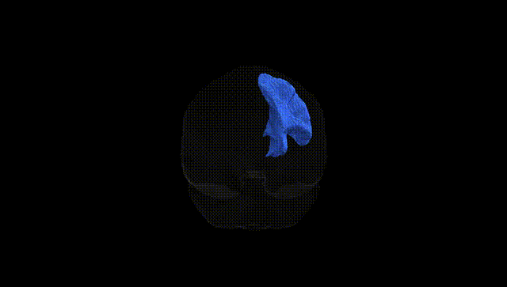

# Striato-precentral right

## Overview

The Striato-precentral right white matter tract, as defined in the Pandora-TractSeg Atlas, is a right-hemispheric frontostriatal projection pathway connecting the striatum (primarily the caudate nucleus and putamen) with the precentral gyrus, which houses the primary motor cortex. This tract conveys motor-related and associative information from basal ganglia circuits to cortical motor regions, participating in the modulation of voluntary movement, motor planning, and possibly aspects of motor learning and habit formation. Fibers travel through the deep frontal white matter, integrating signals from corticostriatal loops that link motor, premotor, and supplementary motor areas with the basal ganglia, thereby contributing to the selection and execution of appropriate motor programs. There is no direct link for this specific tract; a related structure is the [Basal ganglia](https://en.wikipedia.org/wiki/Basal_ganglia).

As of 2024, there appear to be no tract-specific genetic association studies published that directly target the “Striato-precentral right” white matter tract as defined in the Pandora-TractSeg Atlas, and no GWAS has reported loci explicitly annotated to this tract by name. Most diffusion MRI GWAS and imaging–genetics studies of corticostrial and motor-related white matter focus on broader regions (e.g., internal capsule, corticospinal tract, superior longitudinal fasciculus, or global/hemispheric FA and MD) rather than this specific striato-precentral pathway. Large-scale consortia such as ENIGMA and UK Biobank have identified numerous loci influencing diffusion measures (including FA, MD, and related metrics) in frontostriatal and motor tracts, often implicating neurodevelopmental and axonal guidance genes (e.g., genes involved in myelination, cytoskeletal organization, and synaptic development), and some of these loci show pleiotropic associations with neuropsychiatric disorders (schizophrenia, ADHD, major depression), motor or coordination traits, and general cognitive ability. However, these associations have not been localized with sufficient anatomical resolution to attribute them specifically to the striato-precentral tract in the Pandora-TractSeg framework, so any link between particular variants, disorders, and this named tract remains indirect and inferential rather than explicitly demonstrated.

*Overview generated by GPT-4o (2026).*

---

**Region ID:** 51  
**Hemisphere:** right  
**Atlas:** Pandora-TractSeg 

---

## Striato-precentral right – Black Background (Full Brain)

**Full Quality Version:** <a href="full_black.mp4" download>Download MP4</a>

---

## Striato-precentral right – White Background (Full Brain)

**Full Quality Version:** <a href="full_white.mp4" download>Download MP4</a>

---

## Triplanar View – T1 Background

---

## Triplanar View – Ghost Brain


