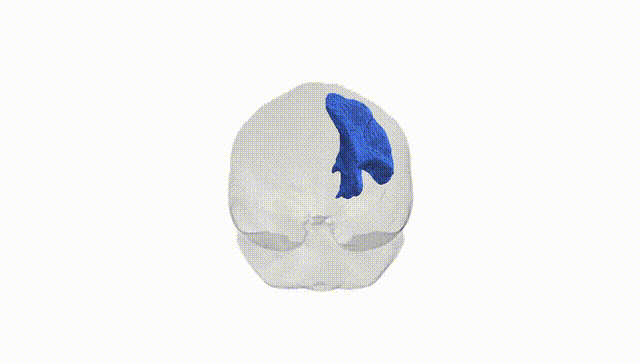
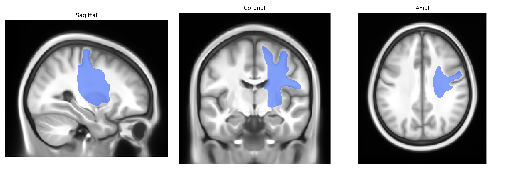
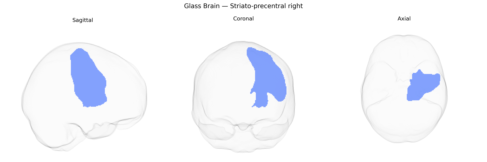

# Striato-precentral right

## Overview

The right Striato-precentral region in the Pandora-TractSeg atlas refers to a corticostriatal projection system linking the right striatum—primarily the putamen—with the right precentral gyrus, which contains primary motor cortex (M1). Biologically, these fibers are part of the basal ganglia–thalamocortical motor loop, in which excitatory glutamatergic neurons from the precentral cortex project to GABAergic medium spiny neurons in the striatum, modulating motor planning, initiation, and execution. This pathway participates in selecting and scaling voluntary movements, integrating cortical motor commands with subcortical processing in the basal ganglia and returning processed signals to motor-related thalamic nuclei and back to motor cortex. The right-sided specification reflects lateralization of motor control, with the right Striato-precentral system contributing predominantly to regulation of movements on the contralateral (left) side of the body and to aspects of motor learning and habit formation. There is no direct Wikipedia link for the “right Striato-precentral” tract; a related and encompassing structure is the basal ganglia, described here: https://en.wikipedia.org/wiki/Basal_ganglia

*Overview generated by GPT-4o (2026).*

---

**Region ID:** 51  
**Hemisphere:** right  
**Atlas:** Pandora-TractSeg 

---

## Striato-precentral right – Black Background (Full Brain)

**Full Quality Version:** [Download MP4](full_black.mp4)

---

## Striato-precentral right – White Background (Full Brain)

**Full Quality Version:** [Download MP4](full_white.mp4)

---

## Striato-precentral right – Black Background (Hemisphere)

**Full Quality Version:** [Download MP4](hemi_black.mp4)

---

## Striato-precentral right – White Background (Hemisphere)

**Full Quality Version:** [Download MP4](hemi_white.mp4)

---

## Triplanar View – T1 Background

---

## Triplanar View – Ghost Brain


