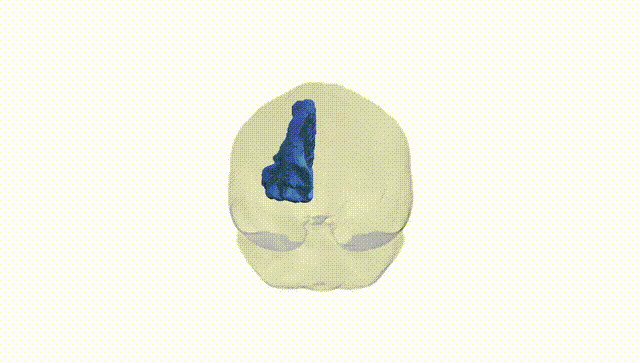
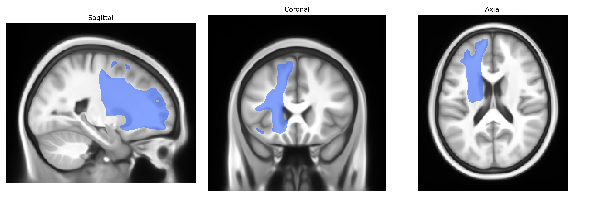
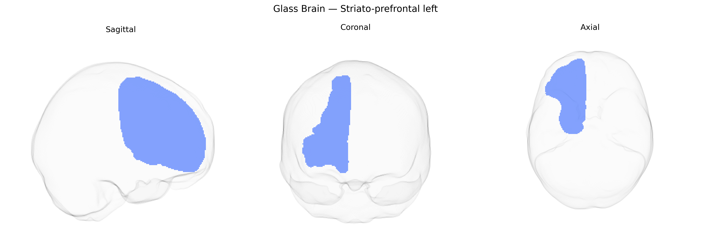

# Striato-prefrontal left

## Overview

The Striato-prefrontal left white matter tract, as defined in the Pandora-TractSeg Atlas, is a left-hemispheric frontostriatal pathway connecting the striatum (primarily the caudate nucleus and putamen) with regions of the prefrontal cortex, including dorsolateral and medial prefrontal areas. Composed of densely myelinated projection fibers, this tract supports bidirectional communication between basal ganglia circuits and prefrontal executive networks, contributing to functions such as action selection, reward-based learning, planning, and cognitive control. Structurally, it courses anteriorly from the dorsal striatum through the deep frontal white matter, integrating with other association and projection systems that converge on the frontal lobe. There is no direct link; see the related structure [Basal ganglia](https://en.wikipedia.org/wiki/Basal_ganglia).

As of current literature, there are no robust, tract-specific genetic association findings published explicitly for the “Striato-prefrontal left” white matter pathway as defined in the Pandora-TractSeg Atlas, and most diffusion MRI GWAS have focused on broader regions (e.g., major fasciculi or voxelwise/ROI-based measures) rather than this fine-grained tract label. Large-scale GWAS of diffusion metrics such as fractional anisotropy and mean diffusivity in striatal–prefrontal and frontostriatal circuitry more generally have implicated genes involved in neurodevelopment, myelination, and axon guidance (e.g., variants near genes such as BDNF, NTRK1/2, CELF4, and several oligodendrocyte- and myelin-related loci), and these measures are often genetically correlated with psychiatric and cognitive traits including schizophrenia, major depressive disorder, ADHD, general cognitive ability, and educational attainment. However, these associations are typically reported at the level of composite frontostriatal networks or larger frontal and striatal white matter regions rather than the specifically delineated Striato-prefrontal left tract in Pandora-TractSeg. Consequently, any genetic or disorder-related inferences for this particular tract are indirect, extrapolated from broader frontostriatal or frontal white matter findings, and no well-established, tract-specific GWAS signals or disorder associations can currently be claimed for this exact anatomical definition.

*Overview generated by GPT-4o (2026).*

---

**Region ID:** 52  
**Hemisphere:** left  
**Atlas:** Pandora-TractSeg 

---

## Striato-prefrontal left – Black Background (Full Brain)

**Full Quality Version:** <a href="full_black.mp4" download>Download MP4</a>

---

## Striato-prefrontal left – White Background (Full Brain)

**Full Quality Version:** <a href="full_white.mp4" download>Download MP4</a>

---

## Triplanar View – T1 Background

---

## Triplanar View – Ghost Brain


