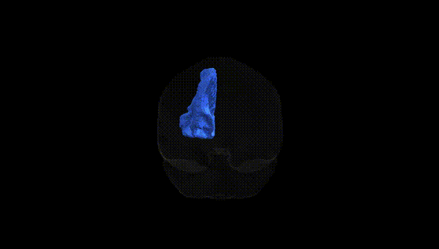

# Striato-prefrontal left

## Overview

The left striato-prefrontal region (as defined in the Pandora-TractSeg Atlas) refers to white matter pathways linking the striatum—primarily the caudate nucleus and putamen—with prefrontal cortical areas in the left hemisphere. These fronto-striatal projections are integral components of cortico-basal ganglia-thalamo-cortical loops that support higher-order cognitive processes, including executive function, working memory, decision-making, and goal-directed behavior, as well as aspects of emotional and motivational regulation. Functionally, activity within this network modulates action selection and reinforcement learning by integrating contextual information from prefrontal cortex with reward-related and motor signals processed in the basal ganglia. Disruption of left striato-prefrontal connectivity has been implicated in various neuropsychiatric and neurodegenerative disorders, such as schizophrenia, obsessive-compulsive disorder, attention-deficit/hyperactivity disorder, and Parkinson’s disease, where altered fronto-striatal communication contributes to deficits in cognition, impulse control, and behavioral flexibility. There is no direct Wikipedia entry for “left striato-prefrontal” as a named tract; a closely related and encompassing structure is the frontostriatal circuitry within the basal ganglia system: https://en.wikipedia.org/wiki/Basal_ganglia.

*Overview generated by GPT-4o (2026).*

---

**Region ID:** 52  
**Hemisphere:** left  
**Atlas:** Pandora-TractSeg 

---

## Striato-prefrontal left – Black Background (Full Brain)

**Full Quality Version:** [Download MP4](full_black.mp4)

---

## Striato-prefrontal left – White Background (Full Brain)

**Full Quality Version:** [Download MP4](full_white.mp4)

---

## Striato-prefrontal left – Black Background (Hemisphere)

**Full Quality Version:** [Download MP4](hemi_black.mp4)

---

## Striato-prefrontal left – White Background (Hemisphere)

**Full Quality Version:** [Download MP4](hemi_white.mp4)

---

## Triplanar View – T1 Background

---

## Triplanar View – Ghost Brain


