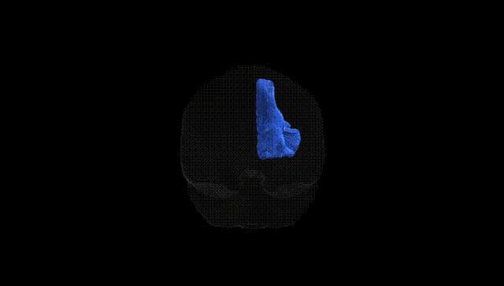

# Striato-prefrontal right

## Overview

The Striato-prefrontal right white matter tract, as defined in the Pandora-TractSeg Atlas, consists of association fibers linking the right striatum—primarily elements of the caudate nucleus and putamen—with regions of the prefrontal cortex involved in higher-order cognitive and executive functions. This pathway conveys integrated information related to motivation, action selection, reward processing, and cognitive control from basal ganglia circuits to prefrontal targets, contributing to goal-directed behavior and decision-making. Functionally, it forms part of frontostriatal loops that modulate planning, working memory, inhibitory control, and emotional regulation. Disruption or abnormal development of this tract has been implicated in neuropsychiatric and neurodegenerative conditions involving impaired executive function, such as obsessive–compulsive disorder, attention-deficit/hyperactivity disorder, and Parkinson’s disease, reflecting its role in coordinating striatal output with prefrontal cortical processing. There is no direct link for this specific tract; a related structure is the [Prefrontal cortex](https://en.wikipedia.org/wiki/Prefrontal_cortex).

As of 2024, there are no tract-specific genetic association studies or GWAS results that uniquely reference the “Striato-prefrontal right” white matter tract as defined in the Pandora-TractSeg Atlas, and no robust literature directly links this exact tract label to particular genes, variants, or disorders. However, diffusion MRI GWAS and imaging–genetics studies of frontostriatal and prefrontal white matter more broadly indicate substantial heritability of fractional anisotropy and mean diffusivity in frontostriatal and prefrontal pathways, with associations reported for genes and loci involved in neurodevelopment, myelination, and synaptic function (e.g., variants near genes such as CADM2, NTRK3, DPYSL5, and others in large ENIGMA and UK Biobank cohorts). Frontostriatal white matter measures have also been linked at a genetic or polygenic level to traits and disorders including schizophrenia, ADHD, depression, autism spectrum disorder, and cognitive/educational outcomes, but these findings are typically reported for broader regions of interest (e.g., anterior internal capsule, anterior corona radiata, prefrontal and striatal connectivity) rather than for the specific Striato-prefrontal right tract as defined in this atlas.

*Overview generated by GPT-4o (2026).*

---

**Region ID:** 53  
**Hemisphere:** right  
**Atlas:** Pandora-TractSeg 

---

## Striato-prefrontal right – Black Background (Full Brain)

**Full Quality Version:** <a href="full_black.mp4" download>Download MP4</a>

---

## Striato-prefrontal right – White Background (Full Brain)

**Full Quality Version:** <a href="full_white.mp4" download>Download MP4</a>

---

## Triplanar View – T1 Background

---

## Triplanar View – Ghost Brain


