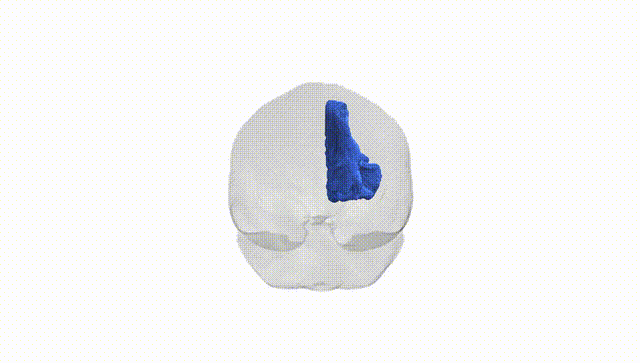
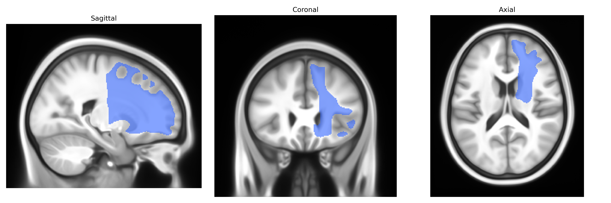
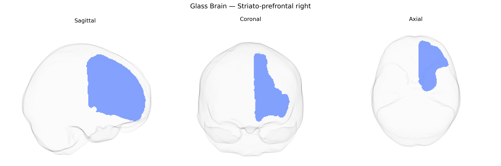

# Striato-prefrontal right

## Overview

The right striato-prefrontal tract in the Pandora-TractSeg atlas represents a major corticostriatal projection system linking the prefrontal cortex of the right hemisphere with components of the dorsal striatum (primarily the caudate nucleus and putamen). Functionally, this pathway is implicated in executive processes such as action selection, working memory, decision-making, and goal-directed behavior, integrating motivational and contextual information from prefrontal areas with basal ganglia circuits that modulate motor output and cognitive flexibility. These fibers form part of looped cortico–basal ganglia–thalamocortical circuits, where prefrontal cortical input to the striatum influences downstream basal ganglia nuclei and, via thalamic relays, feeds back to frontal cortical regions, supporting adaptive control of behavior and reinforcement learning.

There is no direct Wikipedia page for the “right striato-prefrontal” tract. A closely related structure and pathway system is described here: https://en.wikipedia.org/wiki/Corticostriatal_circuit

*Overview generated by GPT-4o (2026).*

---

**Region ID:** 53  
**Hemisphere:** right  
**Atlas:** Pandora-TractSeg 

---

## Striato-prefrontal right – Black Background (Full Brain)

**Full Quality Version:** [Download MP4](full_black.mp4)

---

## Striato-prefrontal right – White Background (Full Brain)

**Full Quality Version:** [Download MP4](full_white.mp4)

---

## Striato-prefrontal right – Black Background (Hemisphere)

**Full Quality Version:** [Download MP4](hemi_black.mp4)

---

## Striato-prefrontal right – White Background (Hemisphere)

**Full Quality Version:** [Download MP4](hemi_white.mp4)

---

## Triplanar View – T1 Background

---

## Triplanar View – Ghost Brain


