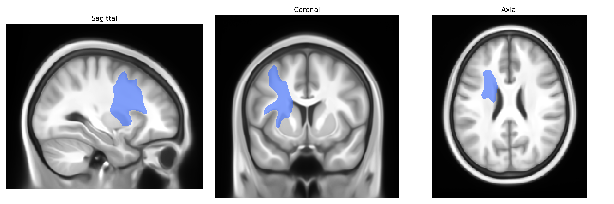

# Striato-premotor left

## Overview

The Striato-premotor left white matter tract, as defined in the Pandora-TractSeg Atlas, is a cortico-subcortical projection pathway connecting the striatum—primarily the caudate nucleus and putamen—to premotor cortical regions in the left hemisphere. This tract is thought to participate in the integration of basal ganglia output with premotor circuits, contributing to the planning, sequencing, and selection of voluntary movements as well as aspects of motor learning and action preparation. By linking striatal processing of motor, cognitive, and motivational information with premotor areas, it forms part of the broader frontostriatal loops that modulate motor behavior and habit formation. There is no direct link for this specific tract; a closely related structure is the [Basal ganglia](https://en.wikipedia.org/wiki/Basal_ganglia).

As of current literature, there are no well-established, tract-specific genetic association studies focused exclusively on the Striato-premotor left white matter tract as defined in the Pandora-TractSeg Atlas, and this exact tract label is generally not used in major GWAS of diffusion MRI measures. However, related fronto-striatal and premotor–basal ganglia pathways, often captured in broader measures of frontal white matter, superior longitudinal fasciculi, or global diffusion metrics (fractional anisotropy, mean diffusivity), show robust heritability and have been linked via GWAS to loci near genes involved in neurodevelopment, axon guidance, and myelination (for example, variants near genes such as CADM2, BDNF, and NRG1 in studies of general white-matter integrity). Polygenic influences on disorders strongly involving fronto-striatal circuits—such as ADHD, obsessive–compulsive disorder, Tourette syndrome, and Parkinson’s disease—as well as traits like cognitive control and motor learning, have been associated with altered diffusion metrics in fronto-striatal and premotor tracts, but these findings are typically reported at the level of regions or major fascicles rather than the specific Striato-premotor tract in the Pandora-TractSeg framework. Accordingly, any genetic associations with this precise tract should be considered indirect and inferred from broader fronto-striatal white-matter and diffusion-MRI GWAS findings rather than directly established.

*Overview generated by GPT-4o (2026).*

---

**Region ID:** 54  
**Hemisphere:** left  
**Atlas:** Pandora-TractSeg 

---

## Striato-premotor left – Black Background (Full Brain)

**Full Quality Version:** <a href="full_black.mp4" download>Download MP4</a>

---

## Striato-premotor left – White Background (Full Brain)

**Full Quality Version:** <a href="full_white.mp4" download>Download MP4</a>

---

## Triplanar View – T1 Background

---

## Triplanar View – Ghost Brain


