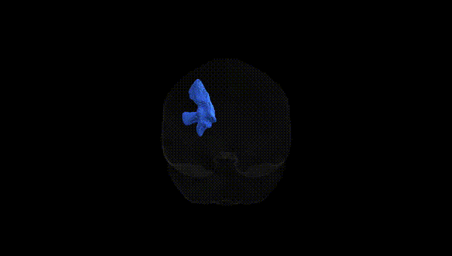
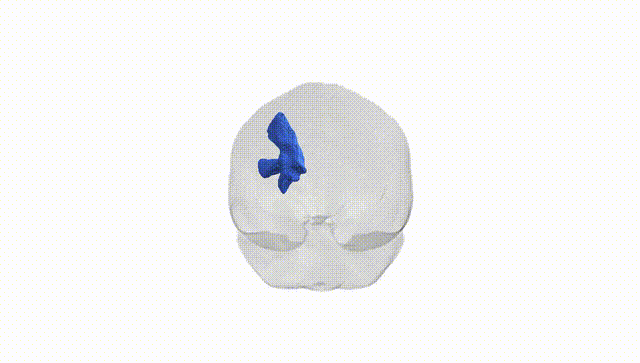
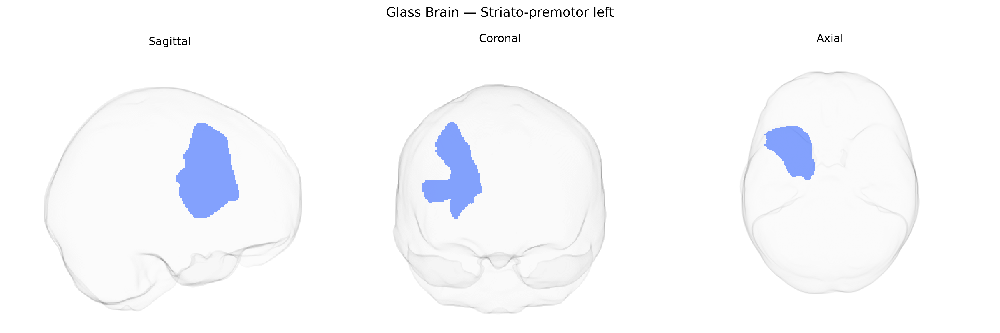

# Striato-premotor left

## Overview

The left striato-premotor tract is a corticostriatal projection pathway linking the dorsal striatum (primarily the putamen and portions of the caudate nucleus) with premotor regions in the lateral frontal lobe of the left hemisphere. Functionally, this pathway contributes to the integration of motor planning, action selection, and the initiation of learned movement sequences by relaying cortical premotor signals to basal ganglia circuits involved in motor control and habit formation. The tract supports processes such as movement preparation, motor set-shifting, and the modulation of motor output via basal ganglia–thalamocortical loops, and is typically lateralized in association with dominant-hemisphere motor and praxis functions. There is no direct Wikipedia page for the “left striato-premotor” pathway; a closely related structure is the dorsal striatum (putamen/caudate): https://en.wikipedia.org/wiki/Dorsal_striatum

*Overview generated by GPT-4o (2026).*

---

**Region ID:** 54  
**Hemisphere:** left  
**Atlas:** Pandora-TractSeg 

---

## Striato-premotor left – Black Background (Full Brain)

**Full Quality Version:** [Download MP4](full_black.mp4)

---

## Striato-premotor left – White Background (Full Brain)

**Full Quality Version:** [Download MP4](full_white.mp4)

---

## Striato-premotor left – Black Background (Hemisphere)

**Full Quality Version:** [Download MP4](hemi_black.mp4)

---

## Striato-premotor left – White Background (Hemisphere)

**Full Quality Version:** [Download MP4](hemi_white.mp4)

---

## Triplanar View – T1 Background

---

## Triplanar View – Ghost Brain


