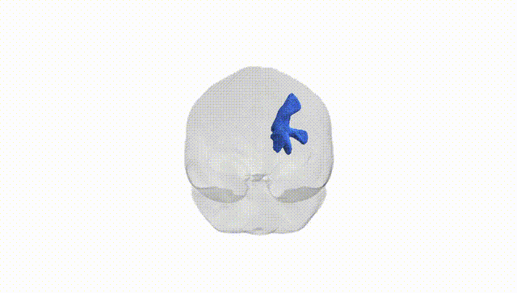

# Striato-premotor right

## Overview

The Striato-premotor right white matter tract, as defined in the Pandora-TractSeg Atlas, consists of association fibers connecting the striatum (primarily the caudate nucleus and putamen) with premotor regions of the frontal lobe in the right hemisphere. This pathway is thought to convey basal ganglia output related to action selection, movement initiation, and motor planning toward premotor cortical areas that prepare and sequence voluntary movements. Through its integration of cortical input (via the cortico-striatal loops) and basal ganglia processing, this tract contributes to the refinement of motor programs, the timing and scaling of movements, and possibly aspects of motor learning and habit formation. Disruption of striato-premotor connectivity has been implicated in movement disorders and may also influence higher-order motor cognition such as planning complex actions or adjusting movements based on feedback. There is no direct link for this specific tract; a closely related structure is the [Basal ganglia](https://en.wikipedia.org/wiki/Basal_ganglia).

As of 2024, there are no tract-specific genetic association findings published for the “Striato-premotor right” white matter pathway as defined in the Pandora-TractSeg Atlas, and this tract label is not yet commonly used as a distinct region of interest in large GWAS. However, extensive diffusion MRI GWAS have identified numerous loci affecting white matter microstructure in frontostriatal and premotor-related pathways more broadly, particularly through measures such as fractional anisotropy (FA) and mean diffusivity (MD) in frontal and subcortical tracts. Large consortia (e.g., ENIGMA, UK Biobank–based studies) have reported SNPs in or near genes involved in neurodevelopment, axonal guidance, myelination, and synaptic function (such as variants near genes regulating oligodendrocyte biology or neuronal growth) that influence FA/MD in frontally projecting and basal ganglia–connected tracts, and polygenic signatures for disorders including schizophrenia, ADHD, major depression, and Parkinson’s disease have been associated with altered frontostriatal and premotor white matter integrity. Nonetheless, no published GWAS to date has isolated the Striato-premotor right tract from Pandora-TractSeg as a unique phenotype, so genetic associations can only be inferred indirectly from broader studies of frontostriatal and premotor white matter rather than from tract-specific evidence.

*Overview generated by GPT-4o (2026).*

---

**Region ID:** 55  
**Hemisphere:** right  
**Atlas:** Pandora-TractSeg 

---

## Striato-premotor right – Black Background (Full Brain)

**Full Quality Version:** <a href="full_black.mp4" download>Download MP4</a>

---

## Striato-premotor right – White Background (Full Brain)

**Full Quality Version:** <a href="full_white.mp4" download>Download MP4</a>

---

## Triplanar View – T1 Background

---

## Triplanar View – Ghost Brain


