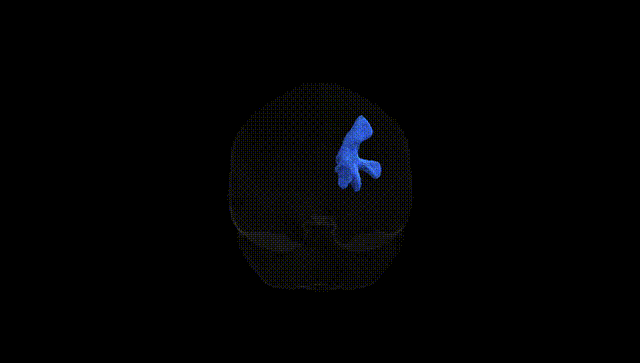
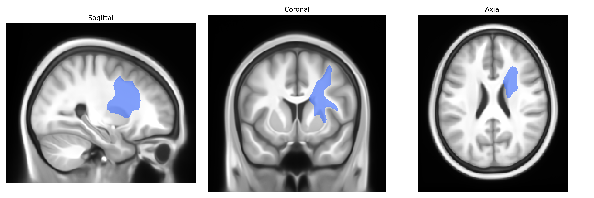
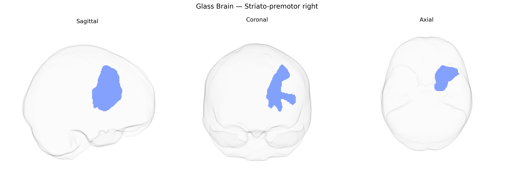

# Striato-premotor right

## Overview

The right striato-premotor region in the Pandora-TractSeg atlas refers to a functionally defined corticostriatal pathway linking the right striatum (primarily caudate nucleus and putamen) with premotor cortical areas involved in the planning and preparation of movement. This tract is part of the basal ganglia–cortical motor circuitry, integrating motor-related, cognitive, and contextual information to modulate the selection and initiation of actions. Afferent fibers from premotor cortex project to the dorsal striatum, where they converge with inputs from other cortical and thalamic regions; striatal output then influences motor thalamus and, indirectly, premotor and primary motor cortices via pallidal and nigral pathways. Functionally, this circuit contributes to movement sequencing, motor learning, and the transformation of sensory cues into motor plans, and may be implicated in motor symptoms of movement disorders when structurally or functionally disrupted. There is no direct Wikipedia page for the “right striato-premotor” tract; a closely related structure is the striatum: https://en.wikipedia.org/wiki/Striatum

*Overview generated by GPT-4o (2026).*

---

**Region ID:** 55  
**Hemisphere:** right  
**Atlas:** Pandora-TractSeg 

---

## Striato-premotor right – Black Background (Full Brain)

**Full Quality Version:** [Download MP4](full_black.mp4)

---

## Striato-premotor right – White Background (Full Brain)

**Full Quality Version:** [Download MP4](full_white.mp4)

---

## Striato-premotor right – Black Background (Hemisphere)

**Full Quality Version:** [Download MP4](hemi_black.mp4)

---

## Striato-premotor right – White Background (Hemisphere)

**Full Quality Version:** [Download MP4](hemi_white.mp4)

---

## Triplanar View – T1 Background

---

## Triplanar View – Ghost Brain


