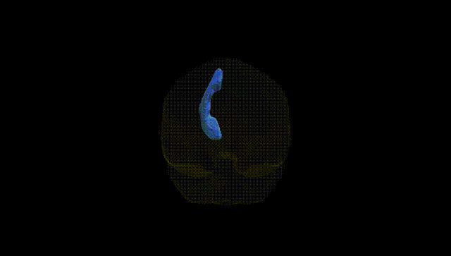
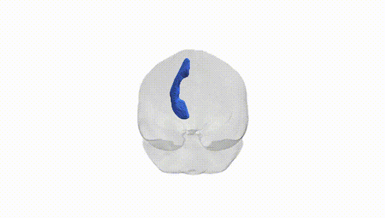
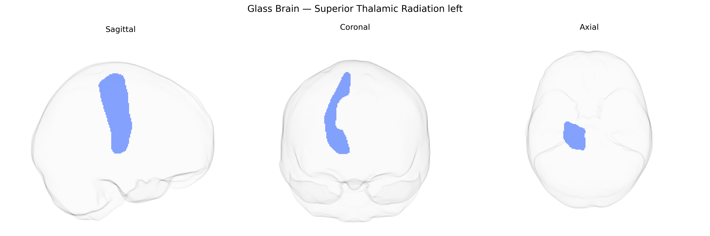

# Superior Thalamic Radiation left

## Overview

The Superior Thalamic Radiation left is a major left-hemispheric white matter pathway that connects the thalamus with dorsal portions of the frontal lobe, including premotor and primary motor cortices. Arising from specific thalamic nuclei, its fibers course superiorly through the posterior limb of the internal capsule and the corona radiata, forming part of the broader thalamocortical projection system. Functionally, this tract is involved in the relay and modulation of motor-related and higher-order integrative signals between the thalamus and frontal cortical regions, contributing to motor planning, execution, and aspects of executive function. In the Pandora-TractSeg Atlas, it is delineated as a lateralized tract (left side) based on diffusion MRI tractography, reflecting its anatomical specificity and separability from other thalamic radiations. There is no direct link for the “Superior Thalamic Radiation” as a standalone article; a closely related structure is the [Thalamic fasciculus](https://en.wikipedia.org/wiki/Thalamic_fasciculus).

As of 2024 there are no tract-specific, robustly replicated genetic association findings published for the left Superior Thalamic Radiation (STR) as defined in the Pandora–TractSeg Atlas, and the literature rarely isolates this tract from other thalamic radiations or broader fronto‑thalamic/association white matter pathways. Large diffusion MRI GWAS (e.g., UK Biobank–based studies by Zhao et al., Elliott et al., Smith et al., and others) have identified numerous loci influencing global and regional measures such as fractional anisotropy, mean diffusivity, and neurite metrics in thalamic radiations and association tracts, with enrichment near genes involved in axon guidance, myelination, and neurodevelopment (e.g., genes related to oligodendrocyte function or neuroaxonal growth), but these findings are generally reported for composite “superior thalamic radiations,” “anterior/superior thalamic radiations,” or grouped fronto‑thalamic tracts rather than the left STR segment specifically. Indirectly, genetic variants linked to schizophrenia, bipolar disorder, major depression, ADHD, and cognitive traits have been associated with microstructural alterations in thalamic radiations on diffusion MRI, but these studies typically do not provide a left-hemisphere STR–specific genetic signal. Overall, current evidence supports substantial heritability and polygenic influence on microstructure of thalamic radiations in general, yet precise gene–trait maps for the left Superior Thalamic Radiation from the Pandora-TractSeg Atlas remain largely uncharacterized in the literature.

*Overview generated by GPT-4o (2026).*

---

**Region ID:** 56  
**Hemisphere:** left  
**Atlas:** Pandora-TractSeg 

---

## Superior Thalamic Radiation left – Black Background (Full Brain)

**Full Quality Version:** <a href="full_black.mp4" download>Download MP4</a>

---

## Superior Thalamic Radiation left – White Background (Full Brain)

**Full Quality Version:** <a href="full_white.mp4" download>Download MP4</a>

---

## Triplanar View – T1 Background

---

## Triplanar View – Ghost Brain


