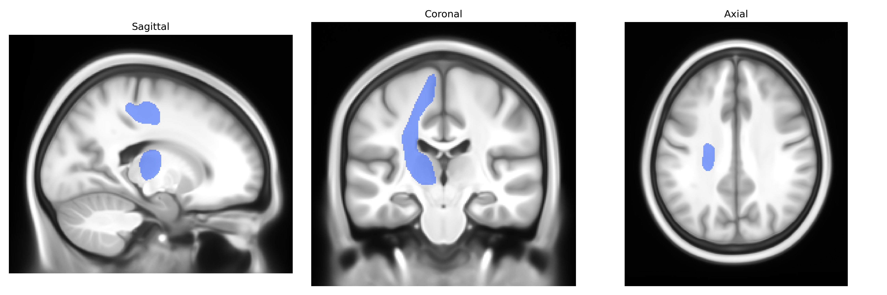

# Superior Thalamic Radiation left

## Overview

The left superior thalamic radiation is a major white matter tract connecting the dorsomedial and lateral thalamic nuclei with superior portions of the cerebral cortex, primarily dorsal premotor, primary motor, and superior frontal regions in the left hemisphere. Composed of myelinated projection fibers, it courses superiorly from the thalamus through the posterior limb of the internal capsule and corona radiata, facilitating rapid bidirectional transmission of sensory-integrative and motor-related information between thalamic relay/association nuclei and frontal cortical areas. Functionally, this tract is involved in higher-order motor planning, modulation of voluntary movement, and integration of thalamocortical signals relevant to executive and attentional processes. Damage or disruption to the left superior thalamic radiation can contribute to motor deficits, disturbances in action planning, and broader thalamocortical dysconnectivity syndromes. There is no direct Wikipedia link for the “superior thalamic radiation”; a related structure and context can be found under the thalamocortical radiations: https://en.wikipedia.org/wiki/Thalamocortical_radiation.

*Overview generated by GPT-4o (2026).*

---

**Region ID:** 56  
**Hemisphere:** left  
**Atlas:** Pandora-TractSeg 

---

## Superior Thalamic Radiation left – Black Background (Full Brain)

**Full Quality Version:** [Download MP4](full_black.mp4)

---

## Superior Thalamic Radiation left – White Background (Full Brain)

**Full Quality Version:** [Download MP4](full_white.mp4)

---

## Superior Thalamic Radiation left – Black Background (Hemisphere)

**Full Quality Version:** [Download MP4](hemi_black.mp4)

---

## Superior Thalamic Radiation left – White Background (Hemisphere)

**Full Quality Version:** [Download MP4](hemi_white.mp4)

---

## Triplanar View – T1 Background

---

## Triplanar View – Ghost Brain


