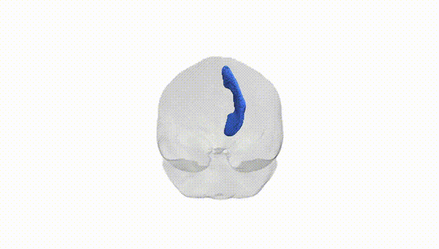
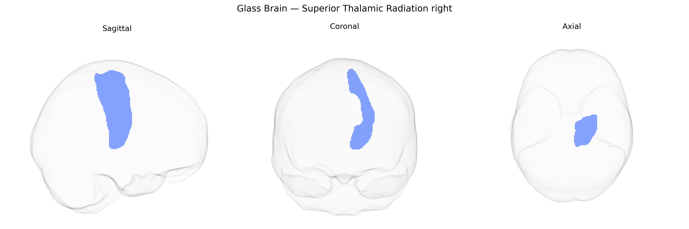

# Superior Thalamic Radiation right

## Overview

The right Superior Thalamic Radiation is a major projection white matter tract that connects the thalamus with the frontal lobe via the anterior limb of the internal capsule, serving as a critical conduit for thalamocortical and corticothalamic signaling involved in motor planning, executive functions, and aspects of attention. Originating from specific thalamic nuclei, its fibers ascend rostrally and laterally, integrating sensory and associative information before terminating in frontal cortical regions, where they contribute to modulation of cortical excitability and information gating. This tract is part of the broader thalamic radiations system, which also includes anterior, posterior, and inferior components, and its integrity is frequently evaluated in diffusion MRI studies for its role in neurodevelopmental, neurodegenerative, and neuropsychiatric conditions. There is no direct link for the Superior Thalamic Radiation; a closely related structure is the [Thalamic radiation](https://en.wikipedia.org/wiki/Thalamic_radiation).

As of 2024, there are no robust, tract-specific genetic association studies published for the right Superior Thalamic Radiation (STR_R) as defined in the Pandora-TractSeg Atlas, and most large neuroimaging GWAS do not report results at this exact tract level. Broadly, diffusion MRI measures such as fractional anisotropy and mean diffusivity in thalamic radiation pathways and adjacent superior thalamic/corticothalamic projections show moderate heritability and have been linked to polygenic influences involving genes related to axon guidance, myelination, and synaptic function (for example, loci near genes like DRAXIN, NRG1, and others in white matter–focused GWAS), but these findings generally aggregate across larger thalamic radiation or global white matter measures rather than isolating the Superior Thalamic Radiation itself. Similarly, associations between thalamic radiation microstructure and psychiatric or neurological phenotypes (including schizophrenia, bipolar disorder, depression, and cognitive performance) have been reported, yet these typically involve composite tracts such as the anterior, superior, or posterior thalamic radiations in aggregate or hemispherically pooled measures, without clear, replicated, gene-level associations specific to the right Superior Thalamic Radiation alone. Overall, current evidence suggests that this tract is likely influenced by the same polygenic architecture that shapes thalamocortical and global white matter integrity, but distinct genetic associations uniquely attributable to the Pandora-TractSeg–defined right Superior Thalamic Radiation have not been clearly delineated or replicated in the existing GWAS literature.

*Overview generated by GPT-4o (2026).*

---

**Region ID:** 57  
**Hemisphere:** right  
**Atlas:** Pandora-TractSeg 

---

## Superior Thalamic Radiation right – Black Background (Full Brain)

**Full Quality Version:** <a href="full_black.mp4" download>Download MP4</a>

---

## Superior Thalamic Radiation right – White Background (Full Brain)

**Full Quality Version:** <a href="full_white.mp4" download>Download MP4</a>

---

## Triplanar View – T1 Background

---

## Triplanar View – Ghost Brain


