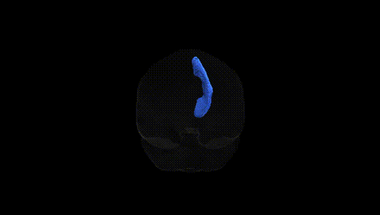
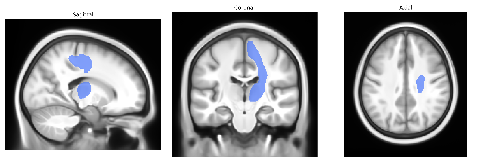

# Superior Thalamic Radiation right

## Overview

The right Superior Thalamic Radiation is a major white matter pathway connecting the thalamus to superior portions of the cerebral cortex, primarily targeting the primary and associative sensorimotor regions in the dorsal frontal and parietal lobes. Emerging from nuclei of the dorsal thalamus, its fibers ascend superiorly through the posterior limb of the internal capsule and corona radiata, distributing thalamocortical projections that relay and modulate somatosensory, motor, and integrative information critical for sensorimotor coordination, movement planning, and higher-order cortical processing. As part of the broader thalamic radiations, it contributes to cortico-thalamo-cortical loops essential for maintaining the flow and integration of information between subcortical relay nuclei and the neocortex. There is no direct Wikipedia page for the “Superior Thalamic Radiation”; a related and encompassing entry is: https://en.wikipedia.org/wiki/Thalamic_radiation

*Overview generated by GPT-4o (2026).*

---

**Region ID:** 57  
**Hemisphere:** right  
**Atlas:** Pandora-TractSeg 

---

## Superior Thalamic Radiation right – Black Background (Full Brain)

**Full Quality Version:** [Download MP4](full_black.mp4)

---

## Superior Thalamic Radiation right – White Background (Full Brain)

**Full Quality Version:** [Download MP4](full_white.mp4)

---

## Superior Thalamic Radiation right – Black Background (Hemisphere)

**Full Quality Version:** [Download MP4](hemi_black.mp4)

---

## Superior Thalamic Radiation right – White Background (Hemisphere)

**Full Quality Version:** [Download MP4](hemi_white.mp4)

---

## Triplanar View – T1 Background

---

## Triplanar View – Ghost Brain


