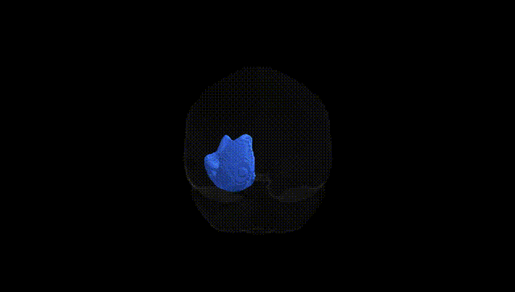
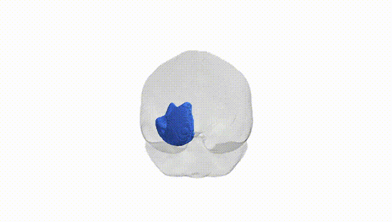
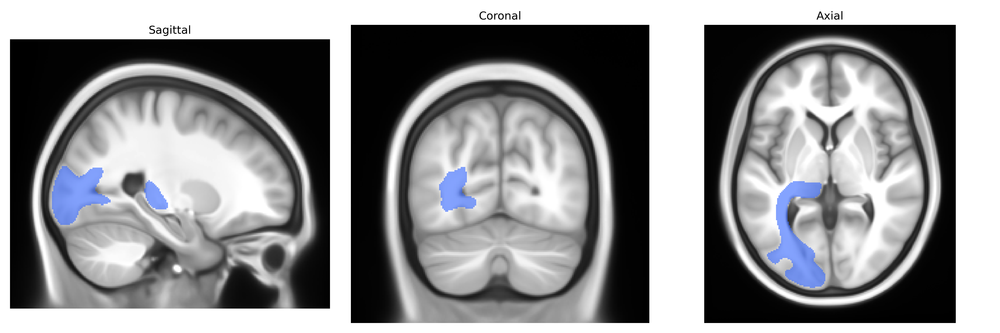
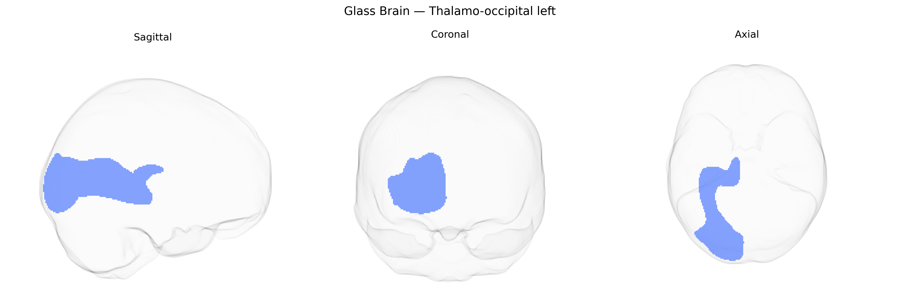

# Thalamo-occipital left

## Overview

The left thalamo-occipital tract (as defined in the Pandora-TractSeg atlas) is a white matter pathway linking nuclei of the left thalamus with occipital cortical regions, particularly visual association areas. Functionally, this projection participates in the relay and integration of visual information, conveying processed retinal input that has been routed through thalamic relay nuclei to higher-order occipital regions involved in visual perception, feature analysis, and visuospatial processing. The tract consists mainly of myelinated fibers coursing posteriorly from the dorsal thalamus through the deep white matter of the parietal and occipital lobes, contributing to the broader thalamocortical network that supports conscious visual experience and the modulation of visual attention. There is no direct Wikipedia entry for the “thalamo-occipital tract”; a closely related and overlapping structure is described here: https://en.wikipedia.org/wiki/Optic_radiation

*Overview generated by GPT-4o (2026).*

---

**Region ID:** 58  
**Hemisphere:** left  
**Atlas:** Pandora-TractSeg 

---

## Thalamo-occipital left – Black Background (Full Brain)

**Full Quality Version:** [Download MP4](full_black.mp4)

---

## Thalamo-occipital left – White Background (Full Brain)

**Full Quality Version:** [Download MP4](full_white.mp4)

---

## Thalamo-occipital left – Black Background (Hemisphere)

**Full Quality Version:** [Download MP4](hemi_black.mp4)

---

## Thalamo-occipital left – White Background (Hemisphere)

**Full Quality Version:** [Download MP4](hemi_white.mp4)

---

## Triplanar View – T1 Background

---

## Triplanar View – Ghost Brain


