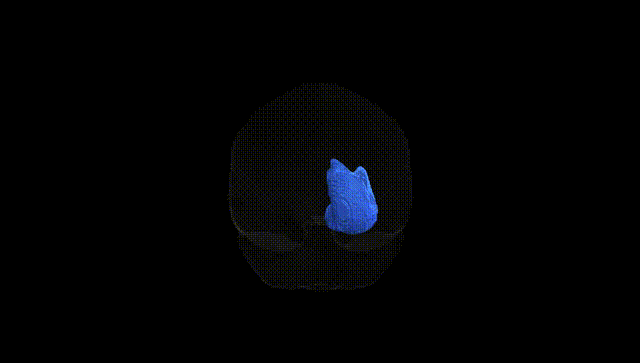
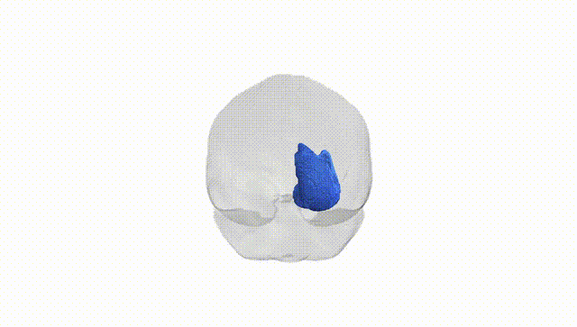
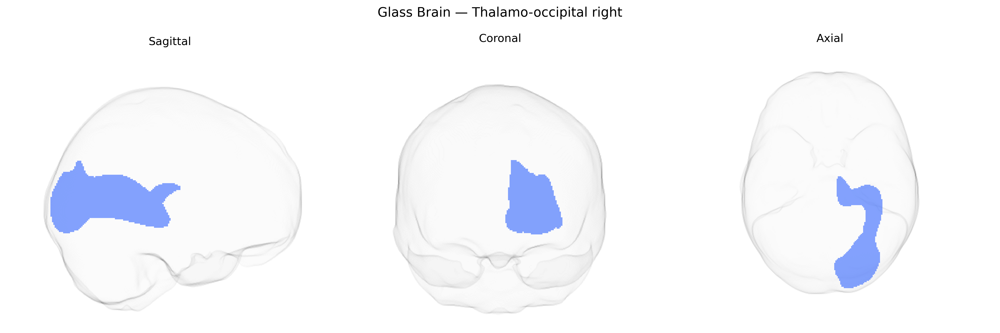

# Thalamo-occipital right

## Overview

The Thalamo-occipital right white matter tract, as defined in the Pandora-TractSeg Atlas, consists of projection fibers connecting nuclei of the right thalamus with the occipital cortex, predominantly involved in visual information processing and modulation. These fibers course posteriorly from the dorsal thalamus, traversing the deep white matter of the parietal and occipital lobes to reach primary and associative visual areas, facilitating the relay and integration of sensory input with higher-order visual functions. Functionally, the tract contributes to visuospatial perception, visual attention, and the coordination of thalamocortical signaling underlying conscious visual experience. Disruption of thalamo-occipital connectivity has been implicated in visual field deficits, impairments in visual awareness, and broader thalamocortical dysrhythmias. There is no direct link for this specific tract; a related structure is the [Thalamus](https://en.wikipedia.org/wiki/Thalamus).

As of current literature, there are no robust, tract-specific genetic association studies reported for the right thalamo-occipital white matter tract as defined in the Pandora-TractSeg Atlas, and most large-scale GWAS of white matter microstructure (e.g., on diffusion MRI metrics such as fractional anisotropy and mean diffusivity) have not yet been resolved to this particular tract with consistent nomenclature. Genome-wide studies (e.g., UK Biobank–based dMRI GWAS) have identified polygenic influences and loci affecting occipital and thalamic projection pathways more broadly, including genes involved in axon guidance, myelination, and neurodevelopment (such as variants near or in genes like PLEKHM1, CRHR1/MAPT region, and others), but these findings are usually reported at the level of global measures, major association pathways, or coarse thalamic–occipital radiations rather than the specific right thalamo-occipital tract. Similarly, disorder-focused imaging–genetics work in conditions such as schizophrenia, major depression, autism spectrum disorder, and visual or attentional phenotypes has implicated thalamo-cortical and occipital connectivity and related diffusion changes, yet the evidence has not converged on clear, replicated gene–tract associations for this particular pathway. Overall, current knowledge about genetic associations specifically tied to the right thalamo-occipital tract from the Pandora-TractSeg Atlas is sparse and largely indirect, inferred from broader thalamo-occipital or visual white matter genetics rather than established for this precise tract.

*Overview generated by GPT-4o (2026).*

---

**Region ID:** 59  
**Hemisphere:** right  
**Atlas:** Pandora-TractSeg 

---

## Thalamo-occipital right – Black Background (Full Brain)

**Full Quality Version:** <a href="full_black.mp4" download>Download MP4</a>

---

## Thalamo-occipital right – White Background (Full Brain)

**Full Quality Version:** <a href="full_white.mp4" download>Download MP4</a>

---

## Triplanar View – T1 Background

---

## Triplanar View – Ghost Brain


