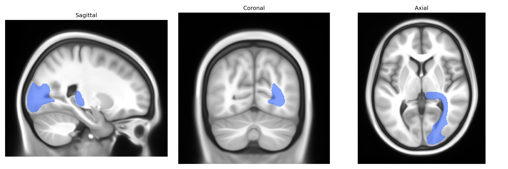

# Thalamo-occipital right

## Overview

The right thalamo-occipital region in the Pandora-TractSeg Atlas refers to a white matter tract or functional pathway connecting nuclei of the right thalamus with occipital cortical areas, primarily involved in the relay and integration of visual and visuospatial information. The thalamus acts as a major subcortical relay center, receiving input from sensory pathways and projecting to distinct cortical regions, while the occipital lobe contains primary and higher-order visual cortices responsible for basic visual processing and more complex visual perception. Thalamo-occipital projections contribute to the transmission of visual signals from subcortical structures (including the lateral geniculate nucleus and associated nuclei) to occipital regions, supporting functions such as visual awareness, spatial localization, and modulation of cortical excitability based on sensory context. In the right hemisphere, these connections may show hemispheric specialization related to spatial attention and global visual processing. There is no direct Wikipedia link for “right thalamo-occipital (Pandora-TractSeg),” but related structures are described at: https://en.wikipedia.org/wiki/Thalamus and https://en.wikipedia.org/wiki/Occipital_lobe

*Overview generated by GPT-4o (2026).*

---

**Region ID:** 59  
**Hemisphere:** right  
**Atlas:** Pandora-TractSeg 

---

## Thalamo-occipital right – Black Background (Full Brain)

**Full Quality Version:** [Download MP4](full_black.mp4)

---

## Thalamo-occipital right – White Background (Full Brain)

**Full Quality Version:** [Download MP4](full_white.mp4)

---

## Thalamo-occipital right – Black Background (Hemisphere)

**Full Quality Version:** [Download MP4](hemi_black.mp4)

---

## Thalamo-occipital right – White Background (Hemisphere)

**Full Quality Version:** [Download MP4](hemi_white.mp4)

---

## Triplanar View – T1 Background

---

## Triplanar View – Ghost Brain


