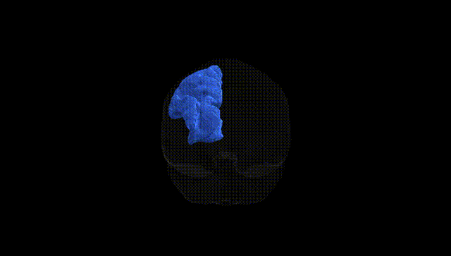
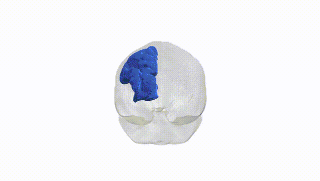

# Thalamo-parietal left

## Overview

The Thalamo-parietal left white matter tract, as defined in the Pandora-TractSeg Atlas, comprises association and projection fibers connecting nuclei of the left thalamus with regions of the left parietal cortex, including areas involved in somatosensory integration, spatial attention, and visuomotor processing. These fibers convey and modulate ascending thalamocortical signals related to tactile, proprioceptive, and multimodal sensory information, as well as descending corticothalamic inputs that regulate thalamic excitability and information gating. Functionally, this pathway contributes to higher-order sensory integration, body schema representation, and aspects of attention and working memory that depend on parietal cortex–thalamus interactions. Structural disruption of the thalamo-parietal tract has been associated with deficits in spatial neglect, altered sensory perception, and impaired sensorimotor coordination. There is no direct link for this tract; a related structure is the [Thalamus](https://en.wikipedia.org/wiki/Thalamus).

As of 2024, there are no known genetic association studies specifically targeting the “Thalamo-parietal left” white matter tract as defined in the Pandora-TractSeg Atlas, and no GWAS has isolated this tract by that exact label in relation to diffusion MRI metrics such as fractional anisotropy or mean diffusivity. Most diffusion MRI GWAS and imaging–genetics studies have focused on broader or differently labeled thalamo-parietal, thalamic radiation, or posterior thalamic pathways, reporting polygenic influences involving genes related to axon guidance, myelination, and synaptic function (e.g., variants in genes associated with neurodevelopmental and psychiatric risk), but these findings are typically aggregated across large tract-classes or lobar regions rather than the Pandora-TractSeg-defined Thalamo-parietal left pathway. Consequently, any inference about genetic influences on this specific tract must be extrapolated from more general thalamocortical and parietal white matter findings, and direct tract-level genetic associations for this exact atlas-defined structure remain essentially uncharacterized in the current literature.

*Overview generated by GPT-4o (2026).*

---

**Region ID:** 60  
**Hemisphere:** left  
**Atlas:** Pandora-TractSeg 

---

## Thalamo-parietal left – Black Background (Full Brain)

**Full Quality Version:** <a href="full_black.mp4" download>Download MP4</a>

---

## Thalamo-parietal left – White Background (Full Brain)

**Full Quality Version:** <a href="full_white.mp4" download>Download MP4</a>

---

## Triplanar View – T1 Background

---

## Triplanar View – Ghost Brain


