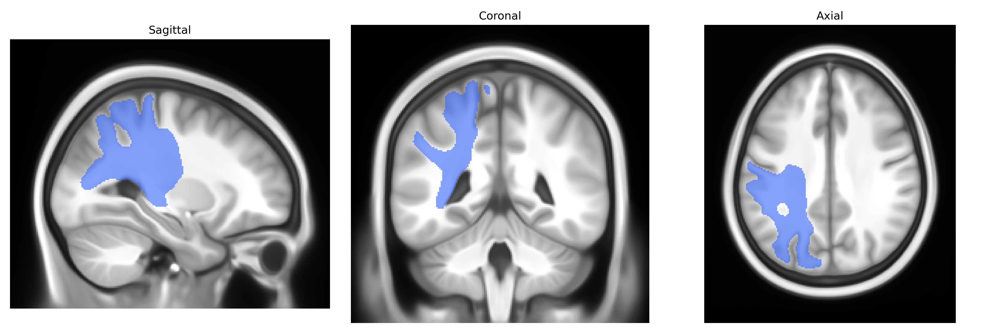
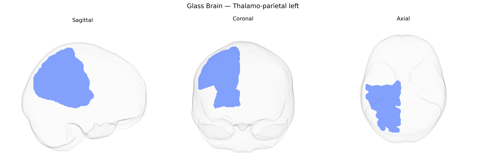

# Thalamo-parietal left

## Overview

The left thalamo-parietal tract in the Pandora-TractSeg atlas refers to a white matter pathway connecting nuclei of the left thalamus with regions of the left parietal cortex, typically including portions of the posterior parietal areas involved in multisensory integration, spatial attention, and higher-order somatosensory processing. Functionally, this pathway supports the relay and modulation of sensory information (particularly somatosensory and visuospatial input) from subcortical thalamic relay nuclei to parietal association cortices, contributing to body schema, spatial orientation, and aspects of sensorimotor coordination and perception. Because damage to thalamo-parietal connections can disrupt these integrative processes, this tract is often implicated in neglect syndromes, deficits in spatial awareness, and higher-order sensory disturbances following stroke or traumatic brain injury. There is no direct Wikipedia entry for the “left thalamo-parietal” tract as defined in the Pandora-TractSeg atlas; a related and overlapping structure is the thalamus: https://en.wikipedia.org/wiki/Thalamus

*Overview generated by GPT-4o (2026).*

---

**Region ID:** 60  
**Hemisphere:** left  
**Atlas:** Pandora-TractSeg 

---

## Thalamo-parietal left – Black Background (Full Brain)

**Full Quality Version:** [Download MP4](full_black.mp4)

---

## Thalamo-parietal left – White Background (Full Brain)

**Full Quality Version:** [Download MP4](full_white.mp4)

---

## Thalamo-parietal left – Black Background (Hemisphere)

**Full Quality Version:** [Download MP4](hemi_black.mp4)

---

## Thalamo-parietal left – White Background (Hemisphere)

**Full Quality Version:** [Download MP4](hemi_white.mp4)

---

## Triplanar View – T1 Background

---

## Triplanar View – Ghost Brain


