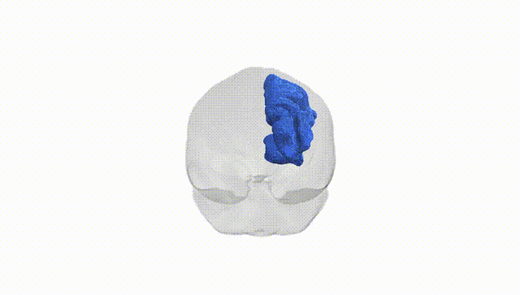
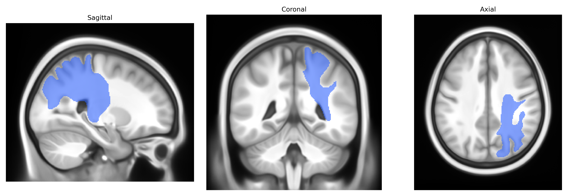

# Thalamo-parietal right

## Overview

The Thalamo-parietal right white matter tract, as defined in the Pandora-TractSeg Atlas, comprises associative projection fibers linking nuclei of the right thalamus with the right parietal cortex, including regions involved in somatosensory integration, spatial attention, and multimodal processing. These fibers convey ascending thalamocortical signals related to sensory information and attentional modulation, while also participating in cortico-thalamic feedback loops that regulate cortical excitability and information gating. Structurally, the tract courses superiorly and posteriorly from the thalamus through the deep white matter, intersecting with other major association and projection pathways, and contributes to the functional connectivity of the right parietal lobe within fronto-parietal and thalamo-cortical networks. There is no direct link; a related structure is the [Thalamus](https://en.wikipedia.org/wiki/Thalamus).

As of 2024, there appear to be no tract-specific genetic association studies published for the right thalamo-parietal white matter pathway as defined in the Pandora-TractSeg atlas, and no GWAS explicitly targeting this labeled tract. Large diffusion MRI GWAS consortia (e.g., ENIGMA, UK Biobank–based studies) have identified common variants in genes involved in axonal development, myelination, and neuronal signaling (such as variants near or in NCAM1, MET, BCL2L1, and several oligodendrocyte- and axon-guidance–related loci) that influence global or regional white matter microstructure, including fractional anisotropy and mean diffusivity across thalamo-cortical and parietal projections, but the reported effects are typically summarized at the level of major bundles (e.g., thalamic radiations, superior longitudinal fasciculus) or whole-brain tract-averaged measures rather than this specific tract label. Genetic correlations have been found between diffusion measures in thalamo-cortical and parietal tracts and a variety of neuropsychiatric or cognitive traits—such as schizophrenia, major depressive disorder, attention-deficit/hyperactivity disorder, intelligence, and educational attainment—yet these are coarse-grained and do not isolate the thalamo-parietal right tract as a distinct unit. Consequently, current evidence for genetic associations specific to the right thalamo-parietal tract, as defined by Pandora-TractSeg, is indirect, inferred from broader thalamic and parietal white matter GWAS signals, and no robust, tract-specific genotype–phenotype mapping has been established.

*Overview generated by GPT-4o (2026).*

---

**Region ID:** 61  
**Hemisphere:** right  
**Atlas:** Pandora-TractSeg 

---

## Thalamo-parietal right – Black Background (Full Brain)

**Full Quality Version:** <a href="full_black.mp4" download>Download MP4</a>

---

## Thalamo-parietal right – White Background (Full Brain)

**Full Quality Version:** <a href="full_white.mp4" download>Download MP4</a>

---

## Triplanar View – T1 Background

---

## Triplanar View – Ghost Brain


