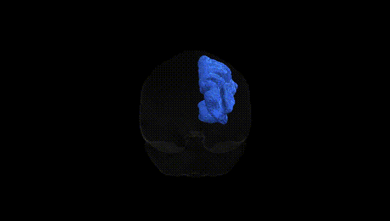
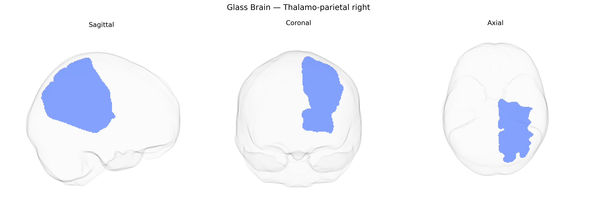

# Thalamo-parietal right

## Overview

The right thalamo-parietal tract (Pandora-TractSeg Atlas) is a right-hemispheric white-matter projection pathway connecting nuclei of the thalamus to regions of the parietal cortex, supporting the relay and integration of sensory information (particularly somatosensory and visuospatial), as well as attention and higher-order multimodal processing. Afferent sensory signals from peripheral pathways are first processed in thalamic nuclei and then transmitted via these thalamo-parietal projections to parietal areas involved in spatial representation, body schema, and sensorimotor coordination, contributing to functions such as spatial awareness, visuomotor integration, and aspects of consciousness. Disruption of the right thalamo-parietal system has been implicated in neglect syndromes, deficits in spatial attention, and impaired integration of sensory modalities. There is no direct Wikipedia link for the “right thalamo-parietal” tract; a related entry describing the broader relay structure is: https://en.wikipedia.org/wiki/Thalamus

*Overview generated by GPT-4o (2026).*

---

**Region ID:** 61  
**Hemisphere:** right  
**Atlas:** Pandora-TractSeg 

---

## Thalamo-parietal right – Black Background (Full Brain)

**Full Quality Version:** [Download MP4](full_black.mp4)

---

## Thalamo-parietal right – White Background (Full Brain)

**Full Quality Version:** [Download MP4](full_white.mp4)

---

## Thalamo-parietal right – Black Background (Hemisphere)

**Full Quality Version:** [Download MP4](hemi_black.mp4)

---

## Thalamo-parietal right – White Background (Hemisphere)

**Full Quality Version:** [Download MP4](hemi_white.mp4)

---

## Triplanar View – T1 Background

---

## Triplanar View – Ghost Brain


