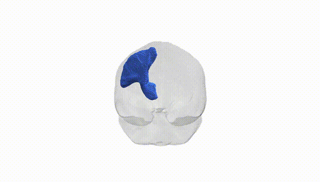
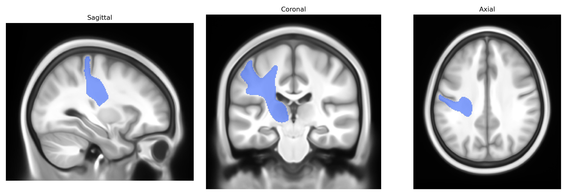

# Thalamo-postcentral left

## Overview

The Thalamo-postcentral left white matter tract, as defined in the Pandora-TractSeg Atlas, consists of projection fibers connecting nuclei of the left thalamus with the left postcentral gyrus, the primary somatosensory cortex. This tract conveys ascending somatosensory information—such as touch, proprioception, and vibration—from thalamic relay nuclei (primarily ventral posterior nuclei) to cortical regions responsible for processing body sensation, contributing to somatotopic organization (sensory homunculus) in the postcentral gyrus. As a component of the broader thalamocortical projection system, it supports conscious perception of bodily stimuli and integration of sensory inputs necessary for fine tactile discrimination and sensorimotor coordination. There is no direct link for this specific tract; a related structure is the [Postcentral gyrus](https://en.wikipedia.org/wiki/Postcentral_gyrus).

As of 2024, there appear to be no robust, tract-specific genetic associations published that focus explicitly on the “Thalamo-postcentral left” white matter pathway as defined in the Pandora-TractSeg Atlas, and major GWAS or imaging-genetics studies rarely report results at this fine-grained tract level. Large diffusion MRI GWAS consortia (e.g., ENIGMA-DTI, UK Biobank imaging studies) have identified numerous loci influencing global or regional measures of white matter microstructure—such as fractional anisotropy (FA) and mean diffusivity (MD)—in thalamocortical and sensorimotor projection systems, and have linked these to neuropsychiatric and neurodevelopmental disorders (including schizophrenia, major depression, bipolar disorder, ADHD, and autism spectrum disorder), cognitive performance, and brain aging, but these findings are typically reported for broader tracts (e.g., posterior thalamic radiations, corticospinal tract, or general “sensorimotor” or “projection” fibers) rather than the specific Thalamo-postcentral left tract. Consequently, any genetic implications for this particular tract must currently be inferred indirectly from studies of related thalamocortical or sensorimotor white matter pathways and not from direct GWAS evidence targeting this exact tract label.

*Overview generated by GPT-4o (2026).*

---

**Region ID:** 62  
**Hemisphere:** left  
**Atlas:** Pandora-TractSeg 

---

## Thalamo-postcentral left – Black Background (Full Brain)

**Full Quality Version:** <a href="full_black.mp4" download>Download MP4</a>

---

## Thalamo-postcentral left – White Background (Full Brain)

**Full Quality Version:** <a href="full_white.mp4" download>Download MP4</a>

---

## Triplanar View – T1 Background

---

## Triplanar View – Ghost Brain


