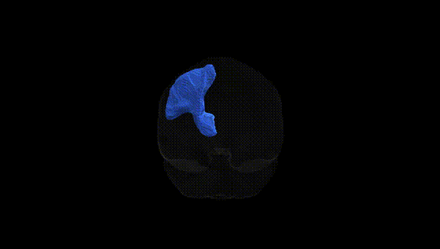
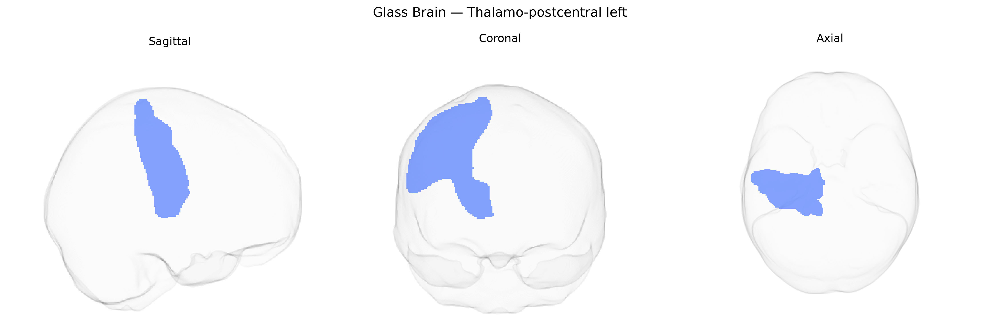

# Thalamo-postcentral left

## Overview

The left thalamo-postcentral tract (Pandora-TractSeg Atlas) is a white matter pathway connecting sensory relay nuclei of the left thalamus—principally the ventral posterior lateral (VPL) nucleus—to the left postcentral gyrus, which contains the primary somatosensory cortex (S1; Brodmann areas 3, 1, and 2). Functionally, this tract transmits ascending somatosensory information, including touch, proprioception, vibration, and, to a lesser extent, pain and temperature signals, from the contralateral side of the body to cortical regions responsible for conscious perception and fine spatial discrimination of somatic stimuli. Damage to this pathway can result in contralateral sensory deficits such as impaired tactile localization, reduced two-point discrimination, and altered proprioception, depending on lesion extent and topography within both the thalamus and postcentral cortical terminations. There is no direct Wikipedia page for the “thalamo-postcentral” tract; a closely related and encompassing structure is the thalamus: https://en.wikipedia.org/wiki/Thalamus

*Overview generated by GPT-4o (2026).*

---

**Region ID:** 62  
**Hemisphere:** left  
**Atlas:** Pandora-TractSeg 

---

## Thalamo-postcentral left – Black Background (Full Brain)

**Full Quality Version:** [Download MP4](full_black.mp4)

---

## Thalamo-postcentral left – White Background (Full Brain)

**Full Quality Version:** [Download MP4](full_white.mp4)

---

## Thalamo-postcentral left – Black Background (Hemisphere)

**Full Quality Version:** [Download MP4](hemi_black.mp4)

---

## Thalamo-postcentral left – White Background (Hemisphere)

**Full Quality Version:** [Download MP4](hemi_white.mp4)

---

## Triplanar View – T1 Background

---

## Triplanar View – Ghost Brain


