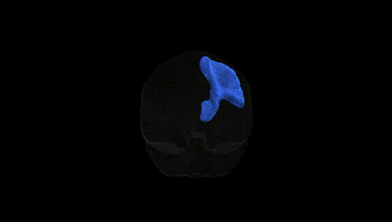

# Thalamo-postcentral right

## Overview

The Thalamo-postcentral right white matter tract is a projection pathway connecting the thalamus—particularly its ventral posterior nuclei involved in somatosensory relay—to the right postcentral gyrus, which houses the primary somatosensory cortex. This tract conveys tactile, proprioceptive, and nociceptive information from the body, relayed via thalamic neurons, to cortical regions responsible for the conscious perception and localization of somatic stimuli. Functionally, it contributes to the processing of contralateral somatosensory input, playing a critical role in fine touch discrimination, body schema representation, and sensorimotor integration. Damage to this pathway can result in sensory deficits such as impaired tactile localization, reduced proprioceptive accuracy, or more complex somatosensory disturbances. There is no direct link for this specific tract; a related structure is the [Postcentral gyrus](https://en.wikipedia.org/wiki/Postcentral_gyrus).

As of 2024, there appear to be no published genetic association studies that specifically target the “Thalamo-postcentral right” white matter tract as defined in the Pandora-TractSeg Atlas, and no GWAS have reported tract-level hits under that exact label. Large diffusion MRI GWAS (e.g., UK Biobank–based studies of fractional anisotropy, mean diffusivity, and other metrics) have identified numerous loci influencing thalamic and sensorimotor white matter microstructure in general—often implicating axon guidance, myelination, and neurodevelopmental pathways—and these alterations have been genetically linked to a range of traits, including general cognitive ability, schizophrenia, major depression, ADHD, and neurodegenerative or cerebrovascular risk factors. However, those studies typically use broader or differently labeled tracts (e.g., posterior thalamic radiations, corticospinal or somatosensory pathways) rather than the Pandora-Thalamo-postcentral definition, so any genetic inferences about this specific tract must be considered indirect and based on its role as part of thalamo-somatosensory and sensorimotor circuitry rather than on tract-precise GWAS evidence.

*Overview generated by GPT-4o (2026).*

---

**Region ID:** 63  
**Hemisphere:** right  
**Atlas:** Pandora-TractSeg 

---

## Thalamo-postcentral right – Black Background (Full Brain)

**Full Quality Version:** <a href="full_black.mp4" download>Download MP4</a>

---

## Thalamo-postcentral right – White Background (Full Brain)

**Full Quality Version:** <a href="full_white.mp4" download>Download MP4</a>

---

## Triplanar View – T1 Background

---

## Triplanar View – Ghost Brain


