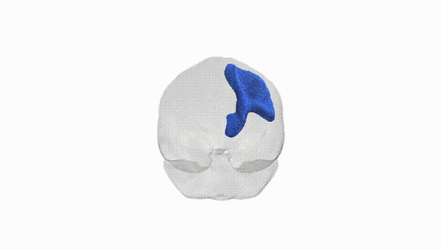
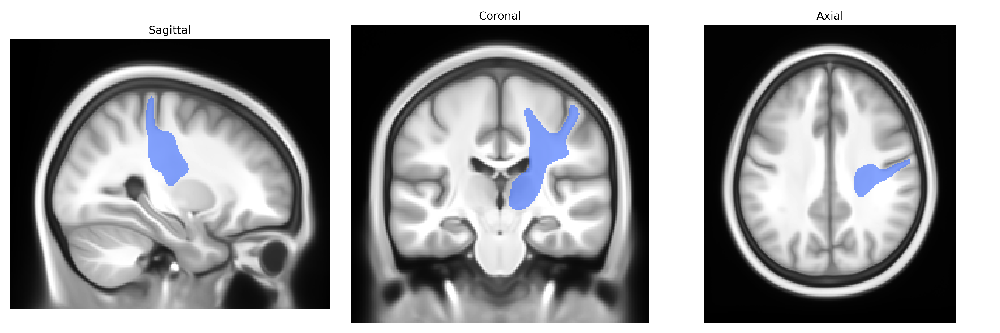
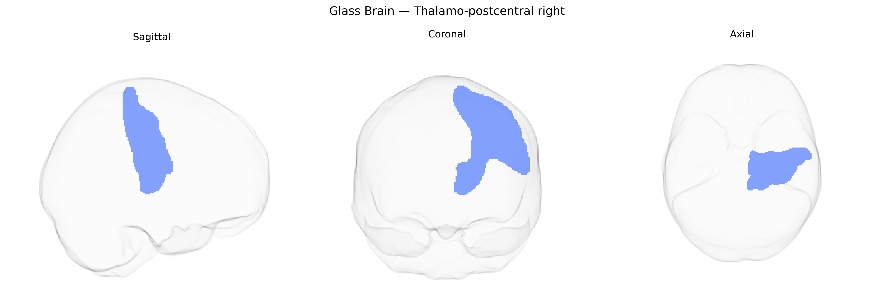

# Thalamo-postcentral right

## Overview

The right thalamo-postcentral tract in the Pandora-TractSeg Atlas represents a white matter projection system connecting nuclei of the right thalamus with the right postcentral gyrus, the primary somatosensory cortex (Brodmann areas 3, 1, and 2). Functionally, this pathway is a key component of the lemniscal somatosensory system, relaying modality-specific tactile, proprioceptive, and discriminative sensory information ascending from the contralateral body via thalamic relay nuclei (primarily the ventral posterior complex) to cortical representations in the postcentral gyrus. The integrity of this projection system is essential for conscious perception and cortical integration of somatic sensory input, and it participates in higher-order processes such as sensorimotor integration, tactile spatial discrimination, and body schema representation. There is no direct Wikipedia page for the “right thalamo-postcentral” tract; a closely related and encompassing structure is the somatosensory system: https://en.wikipedia.org/wiki/Somatosensory_system

*Overview generated by GPT-4o (2026).*

---

**Region ID:** 63  
**Hemisphere:** right  
**Atlas:** Pandora-TractSeg 

---

## Thalamo-postcentral right – Black Background (Full Brain)

**Full Quality Version:** [Download MP4](full_black.mp4)

---

## Thalamo-postcentral right – White Background (Full Brain)

**Full Quality Version:** [Download MP4](full_white.mp4)

---

## Thalamo-postcentral right – Black Background (Hemisphere)

**Full Quality Version:** [Download MP4](hemi_black.mp4)

---

## Thalamo-postcentral right – White Background (Hemisphere)

**Full Quality Version:** [Download MP4](hemi_white.mp4)

---

## Triplanar View – T1 Background

---

## Triplanar View – Ghost Brain


