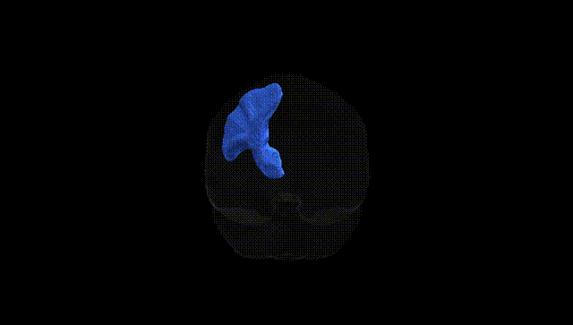
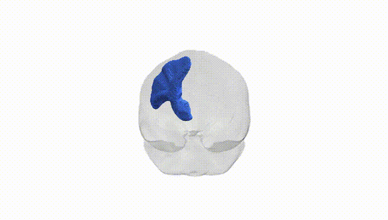
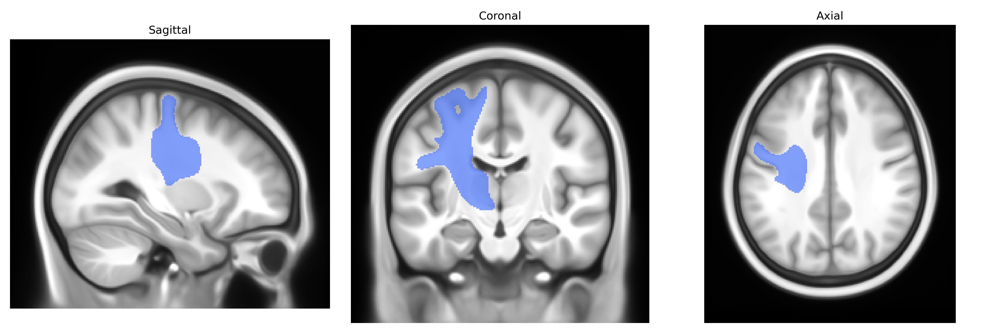
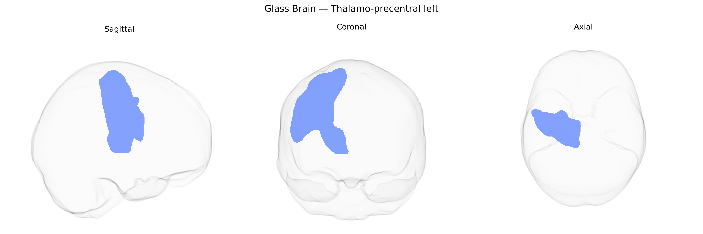

# Thalamo-precentral left

## Overview

The left thalamo-precentral tract (Pandora-TractSeg Atlas) is a white matter pathway connecting motor-related nuclei of the left thalamus with the precentral gyrus (primary motor cortex) in the left frontal lobe. It carries processed thalamic output related to voluntary motor control, integrating subcortical signals with cortical motor planning and execution. Functionally, it contributes to contralateral (right-sided) movement initiation, modulation of muscle tone, and coordination of fine motor activity, acting within cortico-thalamo-cortical loops that also involve basal ganglia and cerebellar circuits. Damage or disruption to this pathway can impair motor performance on the opposite side of the body, potentially leading to weakness, altered motor timing, or deficits in motor coordination, depending on lesion extent and associated structures. There is no direct Wikipedia link for the “left thalamo-precentral” tract; a closely related and encompassing structure is the thalamus: https://en.wikipedia.org/wiki/Thalamus

*Overview generated by GPT-4o (2026).*

---

**Region ID:** 64  
**Hemisphere:** left  
**Atlas:** Pandora-TractSeg 

---

## Thalamo-precentral left – Black Background (Full Brain)

**Full Quality Version:** [Download MP4](full_black.mp4)

---

## Thalamo-precentral left – White Background (Full Brain)

**Full Quality Version:** [Download MP4](full_white.mp4)

---

## Thalamo-precentral left – Black Background (Hemisphere)

**Full Quality Version:** [Download MP4](hemi_black.mp4)

---

## Thalamo-precentral left – White Background (Hemisphere)

**Full Quality Version:** [Download MP4](hemi_white.mp4)

---

## Triplanar View – T1 Background

---

## Triplanar View – Ghost Brain


