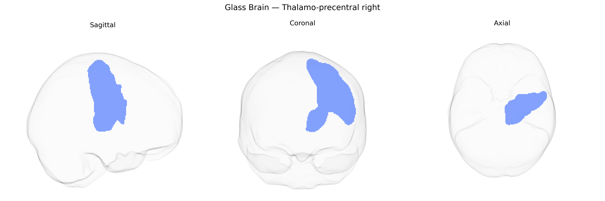

# Thalamo-precentral right

## Overview

The Thalamo-precentral right white matter tract is a major projection pathway connecting thalamic nuclei to the precentral gyrus, which contains the primary motor cortex, in the right cerebral hemisphere. This tract carries processed sensory and integrative signals from the thalamus to motor cortical neurons, playing a key role in motor planning, initiation, and modulation of voluntary movement. Structurally, it consists of myelinated fibers that pass through deep white matter regions, integrating into the broader thalamocortical circuitry that coordinates motor output with sensory feedback and higher-order control systems. There is no direct link for this specific tract; a closely related structure is the [Thalamus](https://en.wikipedia.org/wiki/Thalamus).

As of 2024, there appear to be no published genetic association studies specifically targeting the Thalamo-precentral right white matter tract as defined in the Pandora-TractSeg Atlas, and no GWAS reports that single out this tract by name for diffusion MRI measures such as fractional anisotropy or mean diffusivity. Large diffusion MRI GWAS (e.g., UK Biobank–based studies of white matter microstructure) have identified numerous loci affecting thalamic and precentral (motor) projection tracts more broadly—often implicating genes involved in axonal growth, myelination, and neurodevelopment (such as genes in oligodendrocyte function, cell-adhesion pathways, and cytoskeletal regulation)—and these loci show pleiotropic associations with traits including schizophrenia, major depression, ADHD, general cognitive ability, and motor function. However, those findings are typically reported at the level of major tracts (e.g., corticospinal tract, thalamic radiations, or whole-brain FA/MD factors) rather than the fine-grained, tract-specific parcellations used in Pandora-TractSeg. Consequently, any genetic links to the Thalamo-precentral right tract are currently inferred only indirectly from broader thalamocortical and motor-tract GWAS, and direct, tract-specific genetic associations for this region have not yet been clearly established in the literature.

*Overview generated by GPT-4o (2026).*

---

**Region ID:** 65  
**Hemisphere:** right  
**Atlas:** Pandora-TractSeg 

---

## Thalamo-precentral right – Black Background (Full Brain)

**Full Quality Version:** <a href="full_black.mp4" download>Download MP4</a>

---

## Thalamo-precentral right – White Background (Full Brain)

**Full Quality Version:** <a href="full_white.mp4" download>Download MP4</a>

---

## Triplanar View – T1 Background

---

## Triplanar View – Ghost Brain


