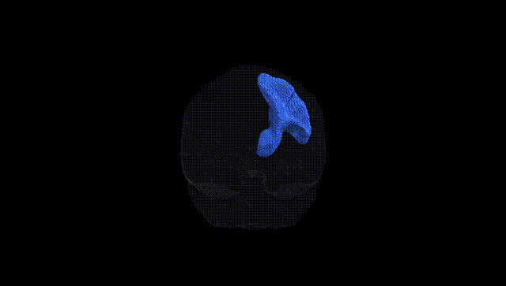
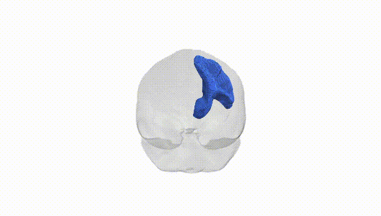
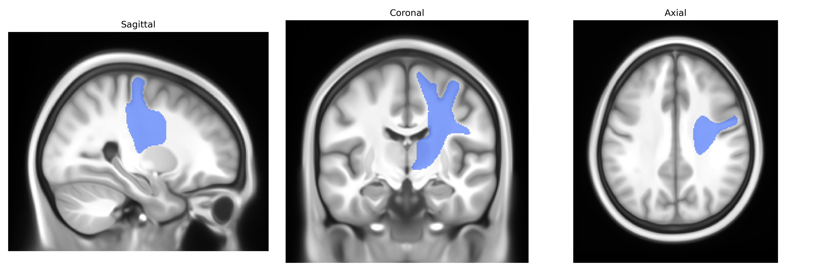

# Thalamo-precentral right

## Overview

The right thalamo-precentral tract (Pandora-TractSeg Atlas) is a white matter projection pathway connecting thalamic nuclei in the right hemisphere to the right precentral gyrus, which houses the primary motor cortex (Brodmann area 4). Functionally, this tract is involved in the relay and modulation of motor-related information, transmitting processed sensory and integrative signals from specific thalamic relay nuclei to cortical motor neurons that initiate and control voluntary movements, particularly of the contralateral (left) side of the body. It forms part of the broader thalamocortical motor network, contributing to motor planning, execution, and fine-tuning, and interacts with basal ganglia and cerebellar loops via thalamic relays. Damage or dysfunction along this pathway can contribute to motor deficits such as weakness, impaired fine motor control, or movement coordination abnormalities.

There is no direct Wikipedia link for the “right thalamo-precentral” tract; a closely related structure is the primary motor cortex in the precentral gyrus: https://en.wikipedia.org/wiki/Primary_motor_cortex

*Overview generated by GPT-4o (2026).*

---

**Region ID:** 65  
**Hemisphere:** right  
**Atlas:** Pandora-TractSeg 

---

## Thalamo-precentral right – Black Background (Full Brain)

**Full Quality Version:** [Download MP4](full_black.mp4)

---

## Thalamo-precentral right – White Background (Full Brain)

**Full Quality Version:** [Download MP4](full_white.mp4)

---

## Thalamo-precentral right – Black Background (Hemisphere)

**Full Quality Version:** [Download MP4](hemi_black.mp4)

---

## Thalamo-precentral right – White Background (Hemisphere)

**Full Quality Version:** [Download MP4](hemi_white.mp4)

---

## Triplanar View – T1 Background

---

## Triplanar View – Ghost Brain


