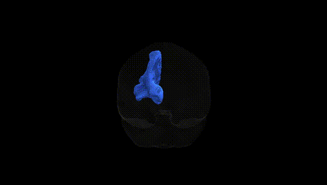
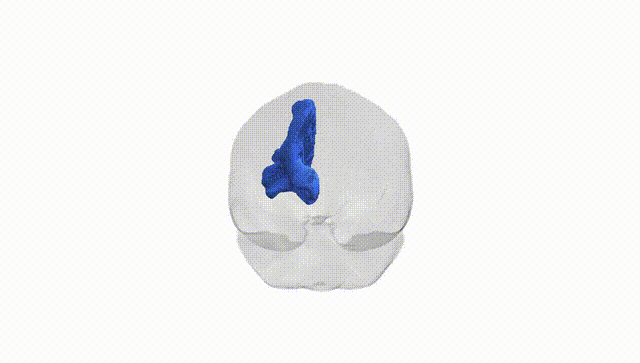
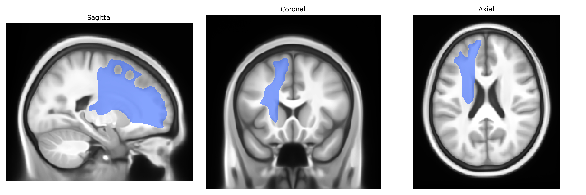
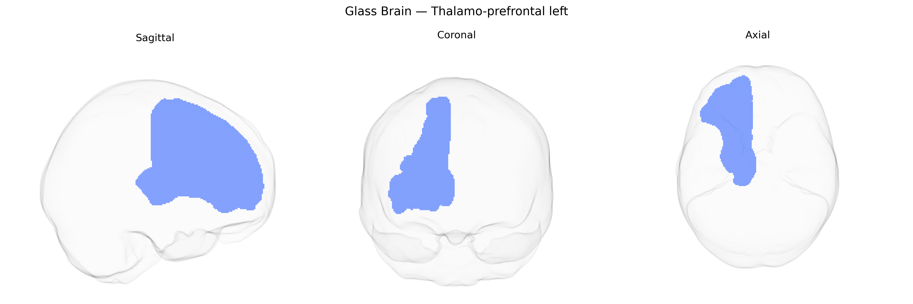

# Thalamo-prefrontal left

## Overview

The Thalamo-prefrontal left white matter tract is a major association/projection pathway linking nuclei of the left thalamus with prefrontal cortical regions, supporting the bidirectional flow of sensory, cognitive, and executive information. Thalamic relay and association nuclei project through this tract to dorsolateral, ventromedial, and orbitofrontal areas, contributing to working memory, decision-making, attentional control, and higher-order integration of multimodal inputs. These fibers course superiorly and anteriorly from the diencephalon through the anterior limb of the internal capsule and adjacent white matter, terminating in layers of the prefrontal cortex where they modulate cortical excitability and synchrony with other large-scale networks. Damage or dysfunction in this pathway is implicated in neuropsychiatric and cognitive disorders involving disrupted thalamo-cortical communication. There is no direct link; a related structure is the [Thalamus](https://en.wikipedia.org/wiki/Thalamus).

As of 2024, there appear to be no tract-specific genetic association studies or GWAS findings reported explicitly for the Thalamo-prefrontal left white matter tract as defined in the Pandora-TractSeg Atlas, and no robust literature directly linking this exact tract label to particular SNPs, genes, or polygenic scores. Most relevant evidence comes from more global or regionally aggregated diffusion MRI GWAS (e.g., studies of thalamic radiations, anterior thalamic radiation, or prefrontal white matter measures), which have identified widespread polygenic influences (including loci near genes such as DCC, NTRK1/2, and others involved in axon guidance, myelination, and neurodevelopment) on fractional anisotropy, mean diffusivity, and related microstructural metrics, and have shown genetic correlations with schizophrenia, bipolar disorder, major depression, cognitive ability, and educational attainment. However, these findings generally treat thalamo-cortical or frontal white matter pathways at coarse anatomical scales and do not isolate the Thalamo-prefrontal left tract as a distinct unit, so any extrapolation from broader thalamo-prefrontal or frontal white matter genetics to this specific Pandora-TractSeg tract should be considered indirect and speculative.

*Overview generated by GPT-4o (2026).*

---

**Region ID:** 66  
**Hemisphere:** left  
**Atlas:** Pandora-TractSeg 

---

## Thalamo-prefrontal left – Black Background (Full Brain)

**Full Quality Version:** <a href="full_black.mp4" download>Download MP4</a>

---

## Thalamo-prefrontal left – White Background (Full Brain)

**Full Quality Version:** <a href="full_white.mp4" download>Download MP4</a>

---

## Triplanar View – T1 Background

---

## Triplanar View – Ghost Brain


