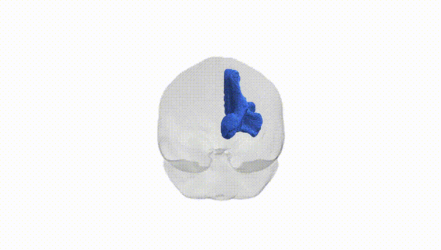
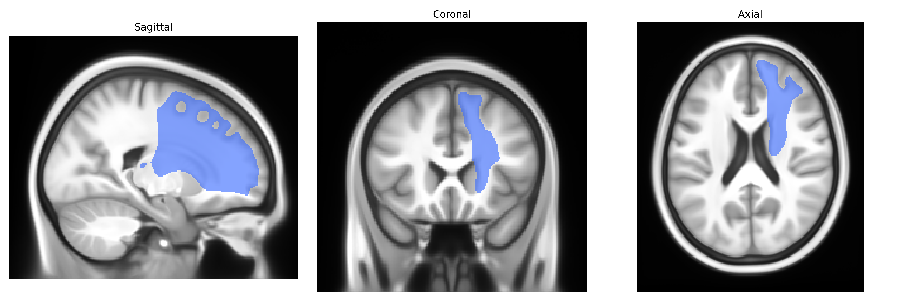

# Thalamo-prefrontal right

## Overview

The Thalamo-prefrontal right white matter tract, as defined in the Pandora-TractSeg Atlas, comprises right-hemisphere projection fibers linking nuclei of the thalamus with regions of the prefrontal cortex involved in higher-order executive, cognitive, and affective processing. These fibers course anteriorly from the dorsal and medial thalamic nuclei, traversing the internal capsule and corona radiata, before terminating in dorsolateral and medial prefrontal areas, thereby supporting functions such as working memory, attention control, decision-making, and emotional regulation. Through bidirectional communication, this tract integrates subcortical relay and modulatory functions of the thalamus with prefrontal circuitry critical for goal-directed behavior and cognitive flexibility, and disruption of its integrity has been implicated in neuropsychiatric and neurodevelopmental conditions affecting executive function. There is no direct link; a related structure is the [Thalamocortical radiations](https://en.wikipedia.org/wiki/Thalamocortical_radiations).

As of 2024, no robust, tract-specific genetic associations have been reported in the literature for the “Thalamo-prefrontal right” white matter tract as defined in the Pandora-TractSeg Atlas; existing large diffusion MRI GWAS typically analyze more generic thalamic–prefrontal or fronto-thalamic pathways, or regional summary measures (e.g., whole thalamic radiation FA/MD), rather than this specific atlas-defined tract. In general, polygenic influences on thalamo-prefrontal connectivity are supported by large datasets (e.g., UK Biobank) showing that diffusion metrics (fractional anisotropy, mean diffusivity) in thalamic radiations are heritable and associated with common variants in genes involved in axon guidance, myelination, and neurodevelopment (such as those in cell-adhesion and oligodendrocyte-related pathways), and these white matter traits share genetic correlations with schizophrenia, bipolar disorder, major depression, ADHD, cognitive performance, and educational attainment. However, no study to date has clearly isolated the Pandora-TractSeg “Thalamo-prefrontal right” tract in a GWAS framework, and therefore any genetic, clinical, or trait associations remain indirect inferences from broader thalamic or prefrontal white matter analyses rather than specific, replicated findings for this named tract.

*Overview generated by GPT-4o (2026).*

---

**Region ID:** 67  
**Hemisphere:** right  
**Atlas:** Pandora-TractSeg 

---

## Thalamo-prefrontal right – Black Background (Full Brain)

**Full Quality Version:** <a href="full_black.mp4" download>Download MP4</a>

---

## Thalamo-prefrontal right – White Background (Full Brain)

**Full Quality Version:** <a href="full_white.mp4" download>Download MP4</a>

---

## Triplanar View – T1 Background

---

## Triplanar View – Ghost Brain


