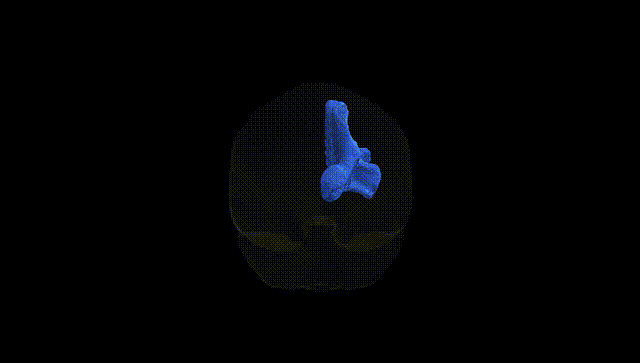
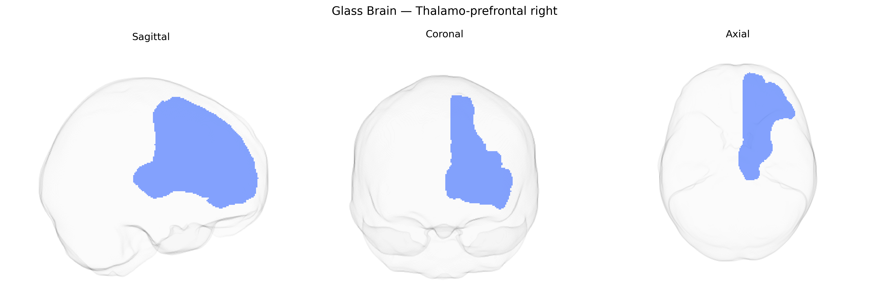

# Thalamo-prefrontal right

## Overview

The right thalamo-prefrontal tract in the Pandora-TractSeg Atlas represents a major white matter pathway connecting nuclei of the right thalamus with prefrontal cortical regions, supporting higher-order cognitive and executive functions. This tract transmits processed sensory, limbic, and associative information from thalamic relay and association nuclei to the prefrontal cortex, contributing to working memory, attention regulation, decision-making, and cognitive control. It forms part of cortico-thalamo-cortical loops that integrate subcortical and cortical activity, influencing goal-directed behavior and the modulation of emotional and motivational states. Disruption of this pathway has been implicated in neuropsychiatric and neurocognitive disorders, including schizophrenia, mood disorders, and disorders of consciousness, where altered thalamo-prefrontal connectivity is associated with deficits in executive function and altered arousal or awareness. There is no direct Wikipedia link for the “right thalamo-prefrontal” tract; a related structure in which it is embedded is the thalamus: https://en.wikipedia.org/wiki/Thalamus

*Overview generated by GPT-4o (2026).*

---

**Region ID:** 67  
**Hemisphere:** right  
**Atlas:** Pandora-TractSeg 

---

## Thalamo-prefrontal right – Black Background (Full Brain)

**Full Quality Version:** [Download MP4](full_black.mp4)

---

## Thalamo-prefrontal right – White Background (Full Brain)

**Full Quality Version:** [Download MP4](full_white.mp4)

---

## Thalamo-prefrontal right – Black Background (Hemisphere)

**Full Quality Version:** [Download MP4](hemi_black.mp4)

---

## Thalamo-prefrontal right – White Background (Hemisphere)

**Full Quality Version:** [Download MP4](hemi_white.mp4)

---

## Triplanar View – T1 Background

---

## Triplanar View – Ghost Brain


