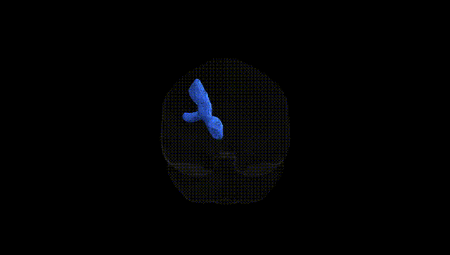
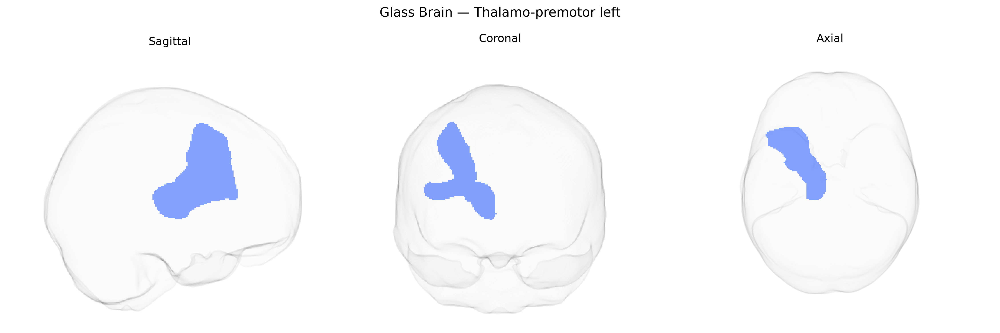

# Thalamo-premotor left

## Overview

The Thalamo-premotor left white matter tract, as defined in the Pandora-TractSeg Atlas, is a left-hemispheric projection pathway connecting nuclei of the thalamus with the premotor cortex, including portions of the dorsal and ventral premotor areas anterior to the primary motor cortex. This tract conveys processed thalamic signals—integrating sensory, cerebellar, and basal ganglia inputs—to premotor regions involved in motor planning, action selection, and the preparation of goal-directed movements. Fibers course superiorly and laterally from the thalamus through the internal capsule and corona radiata before terminating in premotor cortical territories, contributing to cortico-subcortical loops that support motor sequencing and sensorimotor integration. There is no direct Wikipedia article for this tract; a related structure is the [Premotor cortex](https://en.wikipedia.org/wiki/Premotor_cortex).

As of the current literature, there are no tract-specific genetic association studies that isolate the Thalamo-premotor left white matter pathway from the Pandora-TractSeg Atlas, and thus no direct GWAS findings or disorder associations can be confidently attributed to this exact tract. Large diffusion MRI GWAS meta-analyses (e.g., UK Biobank–based studies of fractional anisotropy, mean diffusivity, and related measures) have identified numerous loci and genes (such as those involved in neurodevelopment, myelination, and axonal guidance) that influence white matter microstructure across multiple tracts, and some thalamocortical and frontal projection systems show robust heritability; however, these studies typically analyze broader regions (e.g., internal capsule, corona radiata, or composite thalamic radiation measures) rather than the specific Thalamo-premotor projection defined in Pandora-TractSeg. Similarly, genetic links between white matter measures in thalamocortical/frontal networks and psychiatric or neurological disorders (including schizophrenia, major depressive disorder, ADHD, and Parkinson’s disease) have been reported, but these are generally at the level of large-scale tracts or network-based metrics. Consequently, any genetic or disorder-related inferences for the Thalamo-premotor left tract remain indirect and extrapolated from more global thalamocortical and frontal white matter findings, and specific tract-level genetic associations for this atlas-defined pathway should be considered as currently unknown.

*Overview generated by GPT-4o (2026).*

---

**Region ID:** 68  
**Hemisphere:** left  
**Atlas:** Pandora-TractSeg 

---

## Thalamo-premotor left – Black Background (Full Brain)

**Full Quality Version:** <a href="full_black.mp4" download>Download MP4</a>

---

## Thalamo-premotor left – White Background (Full Brain)

**Full Quality Version:** <a href="full_white.mp4" download>Download MP4</a>

---

## Triplanar View – T1 Background

---

## Triplanar View – Ghost Brain


