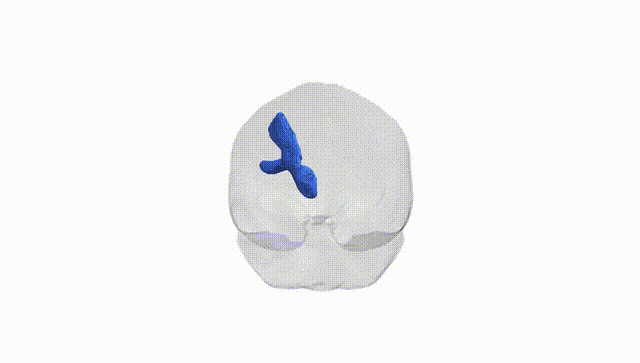
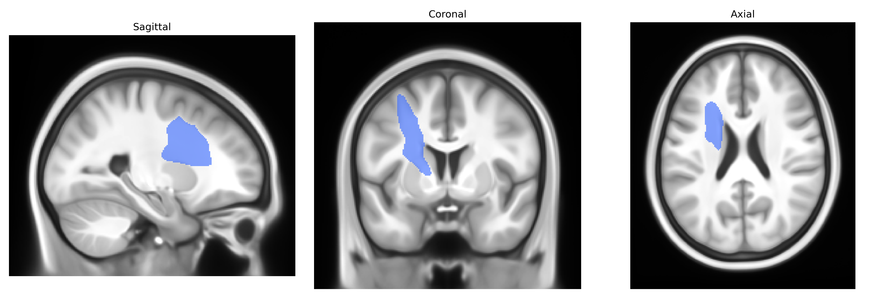

# Thalamo-premotor left

## Overview

The left thalamo-premotor tract in the Pandora-TractSeg Atlas refers to a predominantly ipsilateral white matter pathway connecting thalamic nuclei with premotor cortical regions in the left hemisphere. Functionally, this projection is involved in the integration of sensorimotor, cerebellar, and basal ganglia inputs relayed by the thalamus with premotor areas that are critical for motor planning, movement initiation, and the preparation of complex, goal-directed actions. The tract likely includes fibers originating mainly from motor-related thalamic nuclei (e.g., ventral lateral and ventral anterior nuclei) that project to dorsal and lateral premotor cortex, contributing to the transformation of sensory and internal state information into motor programs, modulation of motor readiness, and coordination of bilateral motor sequences. Through its role in thalamo-cortical loops, this pathway participates in motor learning and the adaptation of movements based on feedback, and may be implicated in motor deficits when structurally or functionally disrupted, such as in stroke or movement disorders.  

There is no direct Wikipedia link for the “left thalamo-premotor” tract; a related structure is the thalamus:  
https://en.wikipedia.org/wiki/Thalamus

*Overview generated by GPT-4o (2026).*

---

**Region ID:** 68  
**Hemisphere:** left  
**Atlas:** Pandora-TractSeg 

---

## Thalamo-premotor left – Black Background (Full Brain)

**Full Quality Version:** [Download MP4](full_black.mp4)

---

## Thalamo-premotor left – White Background (Full Brain)

**Full Quality Version:** [Download MP4](full_white.mp4)

---

## Thalamo-premotor left – Black Background (Hemisphere)

**Full Quality Version:** [Download MP4](hemi_black.mp4)

---

## Thalamo-premotor left – White Background (Hemisphere)

**Full Quality Version:** [Download MP4](hemi_white.mp4)

---

## Triplanar View – T1 Background

---

## Triplanar View – Ghost Brain


