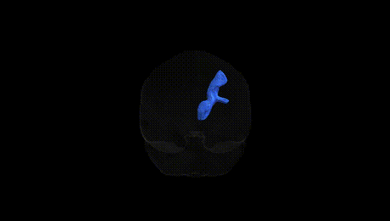
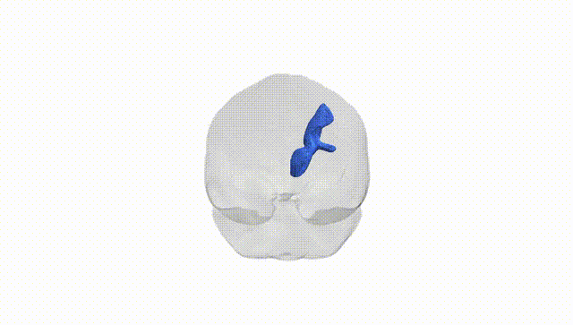
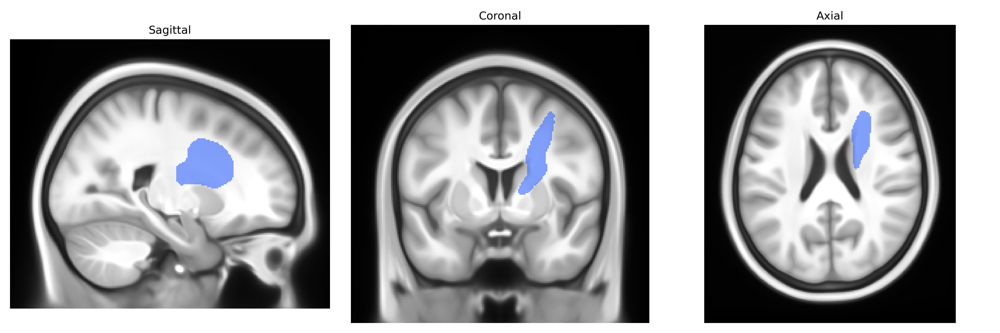
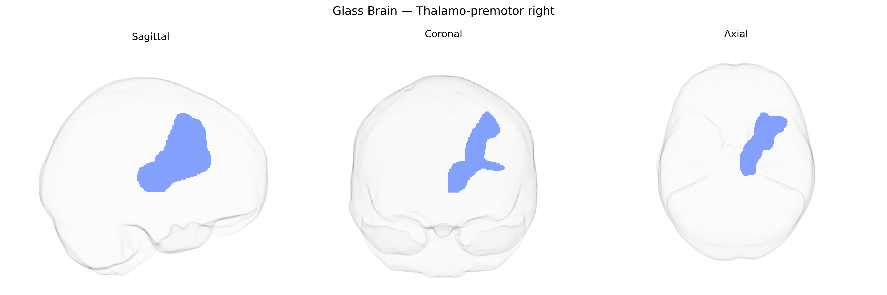

# Thalamo-premotor right

## Overview

The right Thalamo-premotor region in the Pandora-TractSeg Atlas refers to a major white-matter projection system connecting nuclei of the right thalamus with premotor cortical areas in the frontal lobe, involved in the integration and relay of motor-related, sensory, and associative information for the planning and initiation of movement. Thalamic relay and association nuclei send efferent fibers through this pathway to dorsal and ventral premotor cortices, contributing to motor preparation, selection of appropriate motor programs, and coordination with sensory and cognitive inputs. Functionally, this tract participates in cortico–subcortical loops that link basal ganglia, cerebellum, thalamus, and frontal motor areas, supporting tasks such as movement sequencing, motor learning, and the modulation of voluntary actions. There is no direct Wikipedia entry for this specific “right Thalamo-premotor” tract; a related and encompassing structure is the thalamus: https://en.wikipedia.org/wiki/Thalamus

*Overview generated by GPT-4o (2026).*

---

**Region ID:** 69  
**Hemisphere:** right  
**Atlas:** Pandora-TractSeg 

---

## Thalamo-premotor right – Black Background (Full Brain)

**Full Quality Version:** [Download MP4](full_black.mp4)

---

## Thalamo-premotor right – White Background (Full Brain)

**Full Quality Version:** [Download MP4](full_white.mp4)

---

## Thalamo-premotor right – Black Background (Hemisphere)

**Full Quality Version:** [Download MP4](hemi_black.mp4)

---

## Thalamo-premotor right – White Background (Hemisphere)

**Full Quality Version:** [Download MP4](hemi_white.mp4)

---

## Triplanar View – T1 Background

---

## Triplanar View – Ghost Brain


