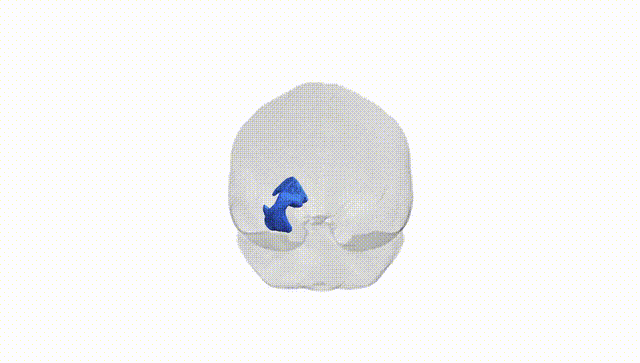
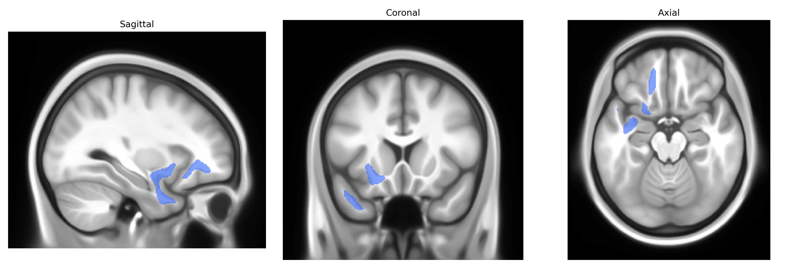
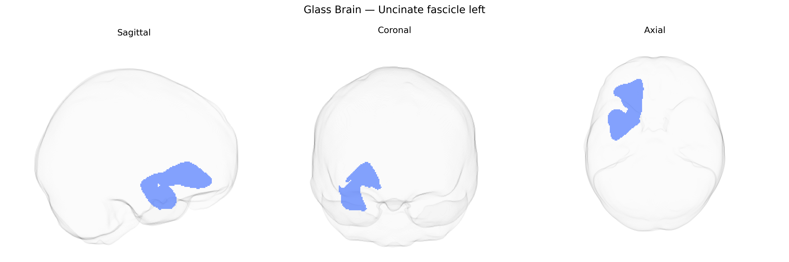

# Uncinate fascicle left

## Overview

The uncinate fascicle (uncinate fasciculus) is a long-range association white matter tract that connects anterior temporal lobe regions, including the temporal pole and amygdala, with orbitofrontal and ventromedial prefrontal cortices in the frontal lobe. It courses medially within the temporal lobe, arches around the Sylvian fissure, and passes through the limen insulae to reach the frontal lobe, forming a hook-shaped pathway from which its name is derived. The uncinate fascicle is implicated in language processes (particularly semantic aspects), social cognition, emotional regulation, and memory, and its microstructural integrity is frequently examined in neuropsychiatric and neurodegenerative disorders. In the Pandora-TractSeg Atlas, the left uncinate fascicle is delineated as a lateralized component of this tract, reflecting hemispheric specialization related to language and affective processing. [Uncinate fasciculus](https://en.wikipedia.org/wiki/Uncinate_fasciculus)

Current genetic knowledge specific to the left uncinate fasciculus (UF-L) as defined in the Pandora-TractSeg atlas is limited; most studies examine the uncinate fasciculus bilaterally or do not distinguish hemispheres. Large diffusion MRI GWAS (e.g., UK Biobank–based studies by Zhao et al. 2021, Elliott et al. 2018, and subsequent analyses) have identified numerous loci associated with diffusion measures such as fractional anisotropy (FA), mean diffusivity (MD), radial diffusivity, and axial diffusivity in the uncinate fasciculus, often implicating genes involved in axon guidance, myelination, and neurodevelopment (for example, variants near genes such as DPYSL5, ROBO1/2, CNTN4, and others in axon–pathfinding pathways), but these are typically reported at the tract level (uncinate fasciculus) rather than specifically UF-L. Polygenic overlap has been reported between UF diffusion metrics and psychiatric and cognitive traits, including schizophrenia, major depression, bipolar disorder, ADHD, and general cognitive ability, consistent with case–control and endophenotype studies showing altered uncinate FA/MD in these conditions, but explicit tract-specific Mendelian randomization evidence remains sparse. Heritability estimates from twin and SNP-based studies indicate that FA and MD in the uncinate fasciculus are moderately heritable, yet clear, replicated gene–trait–tract chains for UF-L alone have not been established, and no major disorder is currently defined by a specific genetic effect on the left uncinate fasciculus as distinct from the right or from the overall tract.

*Overview generated by GPT-4o (2026).*

---

**Region ID:** 70  
**Hemisphere:** left  
**Atlas:** Pandora-TractSeg 

---

## Uncinate fascicle left – Black Background (Full Brain)

**Full Quality Version:** <a href="full_black.mp4" download>Download MP4</a>

---

## Uncinate fascicle left – White Background (Full Brain)

**Full Quality Version:** <a href="full_white.mp4" download>Download MP4</a>

---

## Triplanar View – T1 Background

---

## Triplanar View – Ghost Brain


