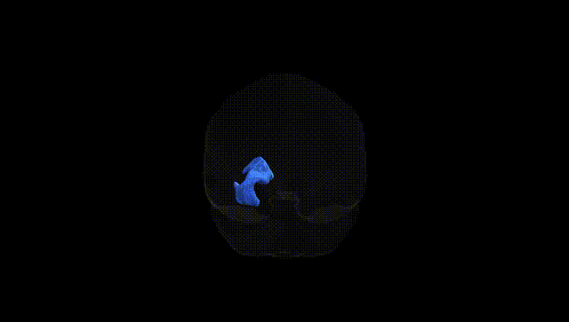

# Uncinate fascicle left

## Overview

The left uncinate fascicle is a long association white matter tract in the left hemisphere that connects the anterior temporal lobe (including temporal pole and parts of the amygdala region) with the orbitofrontal and ventromedial prefrontal cortex. It curves around the lateral sulcus in a hook-like trajectory, traversing the limen insulae and passing medial to the insula and lateral to the basal ganglia. Functionally, it is implicated in semantic language processing, episodic memory, emotional regulation, and social cognition, and alterations in its microstructure have been associated with psychiatric and neurological conditions such as depression, anxiety disorders, temporal lobe epilepsy, and frontotemporal dementia. There is no direct Wikipedia page specifically for the left uncinate fascicle as defined in the Pandora-TractSeg Atlas; a related and encompassing structure is described at: https://en.wikipedia.org/wiki/Uncinate_fasciculus

*Overview generated by GPT-4o (2026).*

---

**Region ID:** 70  
**Hemisphere:** left  
**Atlas:** Pandora-TractSeg 

---

## Uncinate fascicle left – Black Background (Full Brain)

**Full Quality Version:** [Download MP4](full_black.mp4)

---

## Uncinate fascicle left – White Background (Full Brain)

**Full Quality Version:** [Download MP4](full_white.mp4)

---

## Uncinate fascicle left – Black Background (Hemisphere)

**Full Quality Version:** [Download MP4](hemi_black.mp4)

---

## Uncinate fascicle left – White Background (Hemisphere)

**Full Quality Version:** [Download MP4](hemi_white.mp4)

---

## Triplanar View – T1 Background

---

## Triplanar View – Ghost Brain


