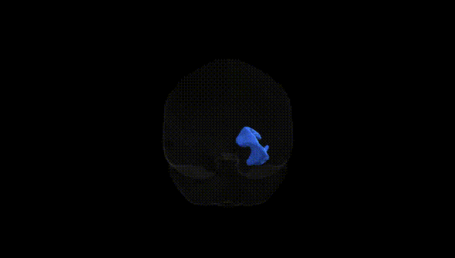
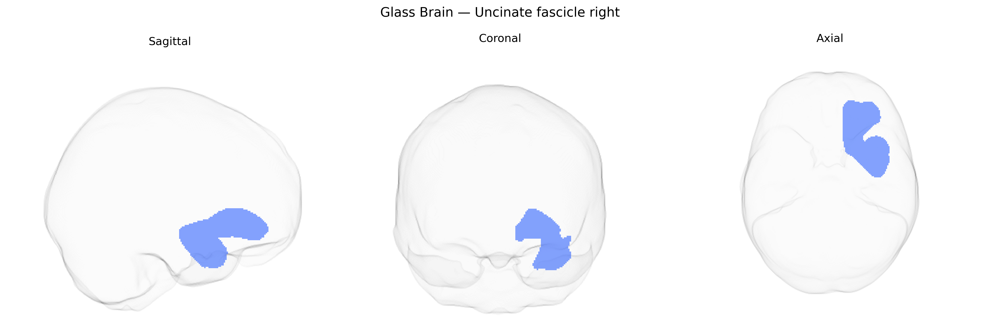

# Uncinate fascicle right

## Overview

The uncinate fascicle is a hook-shaped association white matter tract that connects anterior temporal lobe regions, including the temporal pole and amygdala, with orbitofrontal and ventromedial prefrontal cortices. Running within the anterior temporal stem and curving medially and rostrally beneath the insula and lateral sulcus, it forms part of the ventral language and limbic networks. The uncinate fascicle is implicated in episodic memory, semantic processing, and socio-emotional regulation, and is frequently examined in studies of psychiatric disorders, temporal lobe epilepsy, and neurodegenerative diseases due to its role in frontotemporal connectivity. [Uncinate fasciculus](https://en.wikipedia.org/wiki/Uncinate_fasciculus)

As of current literature, there are no robust, widely replicated genetic associations reported specifically for the right uncinate fasciculus as defined in the Pandora‑TractSeg Atlas, and most available findings concern the uncinate fasciculus more generally or are lateralization‑nonspecific. Large diffusion MRI GWAS consortia (e.g., ENIGMA, UK Biobank–based studies) have identified numerous loci associated with white matter microstructure measures such as fractional anisotropy (FA) and mean diffusivity (MD) across multiple tracts, including the uncinate fasciculus, implicating genes involved in neurodevelopment, axon guidance, myelination, and cell adhesion; however, these results are often reported for bilateral or averaged measures rather than the right tract alone. Polygenic overlap has been observed between global white matter microstructure (including uncinate fasciculus metrics) and neuropsychiatric traits such as schizophrenia, bipolar disorder, major depression, autism spectrum disorder, ADHD, and cognitive performance, but tract‑ and hemisphere‑specific genetic links remain poorly resolved. Some candidate‑gene and smaller imaging‑genetics studies have related variants in genes such as BDNF, NRG1, or DISC1 to uncinate fasciculus FA/MD and to risk for mood and psychotic disorders, yet these findings are inconsistent and not clearly lateralized to the right side. Overall, current evidence supports a polygenic and pleiotropic genetic influence on uncinate fasciculus microstructure as part of broader white matter networks, but specific, replicated GWAS signals uniquely tied to the right uncinate fascicle in the Pandora‑TractSeg Atlas are not yet well established.

*Overview generated by GPT-4o (2026).*

---

**Region ID:** 71  
**Hemisphere:** right  
**Atlas:** Pandora-TractSeg 

---

## Uncinate fascicle right – Black Background (Full Brain)

**Full Quality Version:** <a href="full_black.mp4" download>Download MP4</a>

---

## Uncinate fascicle right – White Background (Full Brain)

**Full Quality Version:** <a href="full_white.mp4" download>Download MP4</a>

---

## Triplanar View – T1 Background

---

## Triplanar View – Ghost Brain


