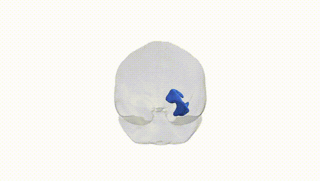
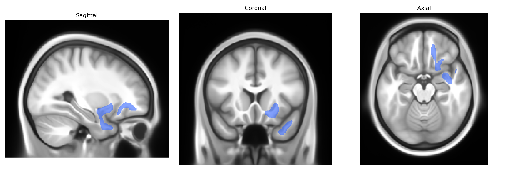

# Uncinate fascicle right

## Overview

The right uncinate fascicle is a hook-shaped white matter association tract in the right hemisphere that connects anterior temporal lobe structures (including parts of the temporal pole and amygdaloid complex) with the orbitofrontal and ventromedial prefrontal cortices. It courses medially within the temporal stem, curves around the lateral sulcus, and passes through the anterior floor of the external/extreme capsule region. Functionally, the uncinate fascicle is implicated in higher-order socio-emotional processing, episodic and semantic memory, and aspects of language, particularly in integrating emotional valence with semantic content and decision-making. In the Pandora-TractSeg Atlas, the “right uncinate fascicle” label corresponds to this right-lateralized tract segment, delineated on the basis of diffusion MRI tractography and standardized anatomical criteria. There is no direct Wikipedia entry for the right uncinate fascicle as a separate structure; a related article describing the uncinate fasciculus in general is available at: https://en.wikipedia.org/wiki/Uncinate_fasciculus

*Overview generated by GPT-4o (2026).*

---

**Region ID:** 71  
**Hemisphere:** right  
**Atlas:** Pandora-TractSeg 

---

## Uncinate fascicle right – Black Background (Full Brain)

**Full Quality Version:** [Download MP4](full_black.mp4)

---

## Uncinate fascicle right – White Background (Full Brain)

**Full Quality Version:** [Download MP4](full_white.mp4)

---

## Uncinate fascicle right – Black Background (Hemisphere)

**Full Quality Version:** [Download MP4](hemi_black.mp4)

---

## Uncinate fascicle right – White Background (Hemisphere)

**Full Quality Version:** [Download MP4](hemi_white.mp4)

---

## Triplanar View – T1 Background

---

## Triplanar View – Ghost Brain


