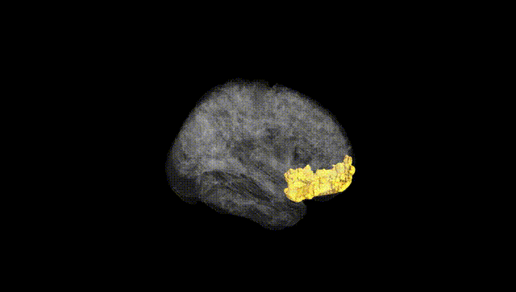
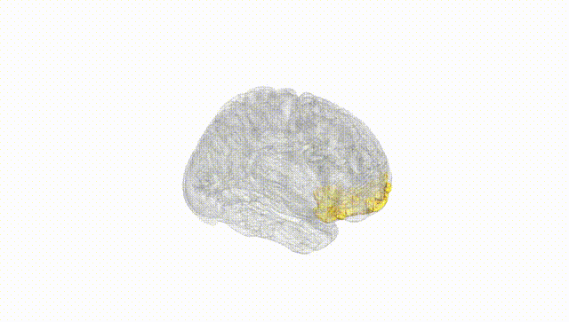
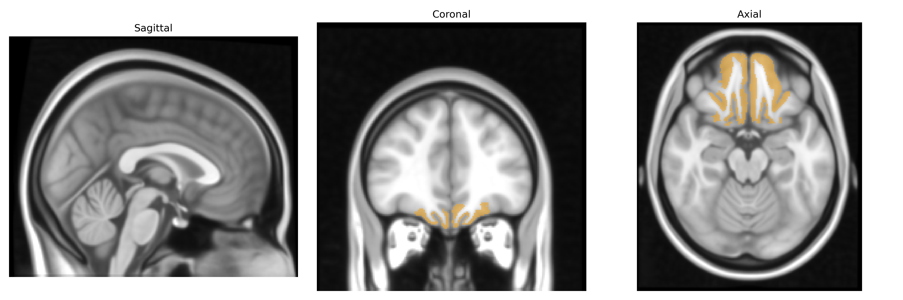
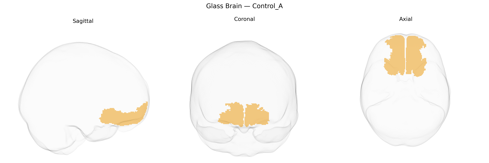

# Control_A
 
## Overview
 
The Bilateral Control_A region in the Yeo-17 functional atlas is part of the frontoparietal “control” network, typically encompassing dorsal lateral prefrontal and parietal association cortices in both hemispheres that support executive control, flexible cognitive operations, and goal-directed behavior. This network is engaged during tasks requiring working memory, attention shifting, decision-making, and the integration of sensory information with internal goals, and it plays a crucial role in coordinating activity across other large-scale networks such as default mode and dorsal attention systems. While there is no direct Wikipedia article for the “Bilateral Control_A” parcel itself, it is closely related to the [Frontoparietal network](https://en.wikipedia.org/wiki/Executive_functions#Neural_basis).
 
Genetic associations for the Bilateral Control_A region of the Yeo-17 atlas, part of the frontoparietal control network, largely reflect findings for cognitive control, executive function, and related psychiatric and neurological traits rather than for this parcel by name. GWAS of cortical thickness and surface area (e.g., ENIGMA and UK Biobank–based studies) have identified multiple loci (including variants near genes such as MAPT, KTN1, and IGF2BP1, among others) that influence morphology of lateral prefrontal and parietal areas overlapping Control_A, with polygenic overlap with intelligence, educational attainment, and processing speed. Large-scale neuroimaging genetics work has also shown that SNP-based heritability is substantial for activation and connectivity patterns within the frontoparietal network during working memory and cognitive control tasks, and polygenic scores for schizophrenia, major depressive disorder, ADHD, and autism spectrum disorder have been linked to altered structure or functional connectivity in network regions encompassing Control_A. Additionally, variants associated with Alzheimer’s disease risk (e.g., in APOE and nearby loci) show effects on cortical thinning and connectivity in frontal and parietal control regions, implicating this network in early neurodegenerative changes. However, available genetic results are typically reported at the level of broader networks or standard anatomical regions rather than the specific Yeo-17 Control_A parcel, so associations are inferred from overlap with these larger frontoparietal control territories.
 
*Overview generated by GPT-4o (2026).*
 
---
 
**Region ID:** 10  
**Hemisphere:** Bilateral  
**Atlas:** Yeo-17 
 
---
 
## Control_A – Black Background (Full Brain)
 

 
**Full Quality Version:** <a href="full_black.mp4" download>Download MP4</a>
 
---
 
## Control_A – White Background (Full Brain)
 

 
**Full Quality Version:** <a href="full_white.mp4" download>Download MP4</a>
 
---

## Triplanar View – T1 Background
 

 
---
 
## Triplanar View – Ghost Brain
 


