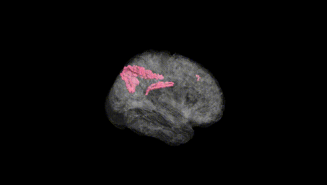
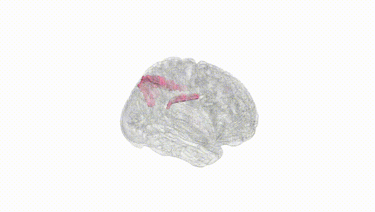
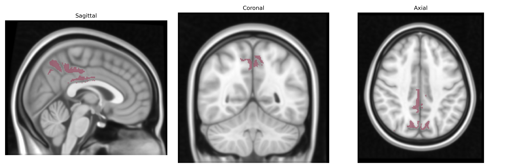
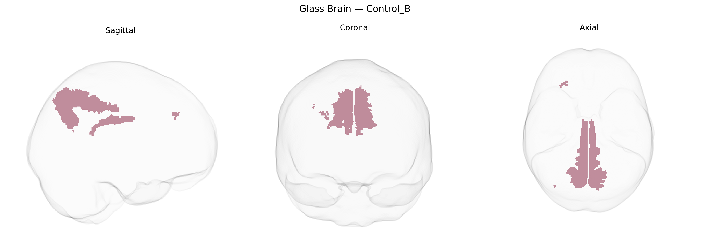

# Control_B

## Overview

The Bilateral Control_B region in the Yeo-17 functional atlas is part of the frontoparietal “control” network, which is implicated in higher-order cognitive control, flexible goal-directed behavior, and the integration of information across sensory and associative regions. This network typically involves lateral prefrontal cortex and posterior parietal areas, supporting functions such as working memory, task switching, and top-down modulation of attention. In the Yeo-17 parcellation, Control_B represents one of several subnetworks within the broader frontoparietal control system, characterized by bilateral symmetry and strong functional connectivity with other control and default-mode-related territories. There is no direct Wikipedia page for “Bilateral Control_B” or the exact Yeo-17 parcel, but a closely related and encompassing structure is the frontoparietal network: https://en.wikipedia.org/wiki/Frontoparietal_network

*Overview generated by GPT-4o (2026).*

---

**Region ID:** 11  
**Hemisphere:** Bilateral  
**Atlas:** Yeo-17 

---

## Control_B – Black Background (Full Brain)

**Full Quality Version:** [Download MP4](full_black.mp4)

---

## Control_B – White Background (Full Brain)

**Full Quality Version:** [Download MP4](full_white.mp4)

---

## Triplanar View – T1 Background

---

## Triplanar View – Ghost Brain


