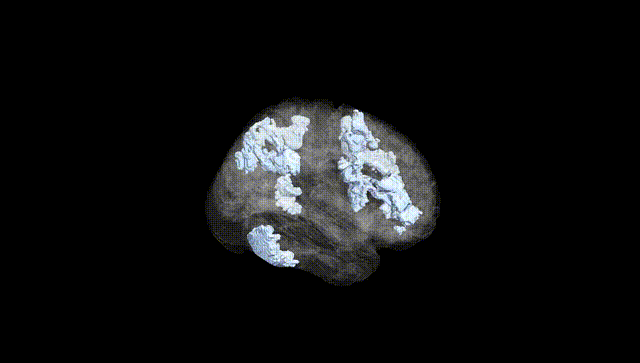
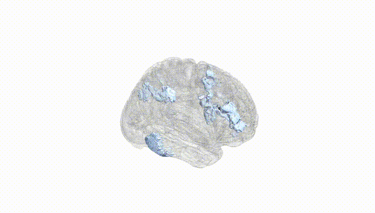
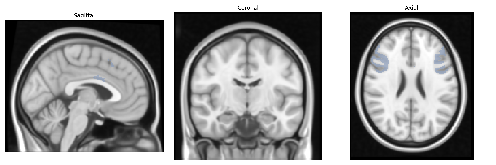
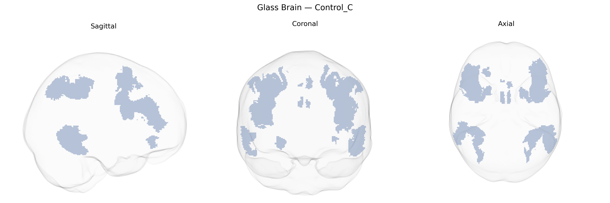

# Control_C

## Overview

The Bilateral Control_C network in the Yeo-17 atlas is a subdivision of the frontoparietal “control” system implicated in higher-order cognitive control, flexible task set maintenance, and the integration of sensory information with goal-directed behavior. This network typically comprises bilateral regions of the lateral prefrontal cortex and posterior parietal cortex, including parts of the middle frontal gyrus, inferior frontal sulcus, and intraparietal sulcus, which together support adaptive reconfiguration of brain activity in response to changing task demands. Functionally, Control_C is thought to interact with both default mode and dorsal attention networks, mediating switching between internal mentation and externally oriented attention and coordinating distributed processing required for complex reasoning, working memory, and decision-making. There is no direct Wikipedia page for “Bilateral Control_C” from the Yeo-17 atlas; a closely related and encompassing concept is the frontoparietal network: https://en.wikipedia.org/wiki/Frontoparietal_network

*Overview generated by GPT-4o (2026).*

---

**Region ID:** 12  
**Hemisphere:** Bilateral  
**Atlas:** Yeo-17 

---

## Control_C – Black Background (Full Brain)

**Full Quality Version:** [Download MP4](full_black.mp4)

---

## Control_C – White Background (Full Brain)

**Full Quality Version:** [Download MP4](full_white.mp4)

---

## Triplanar View – T1 Background

---

## Triplanar View – Ghost Brain


