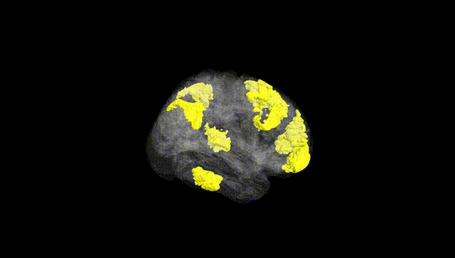
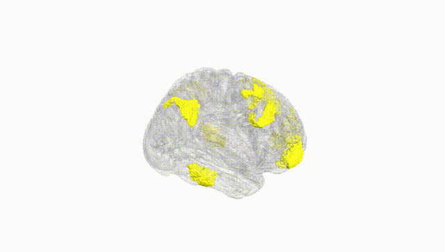
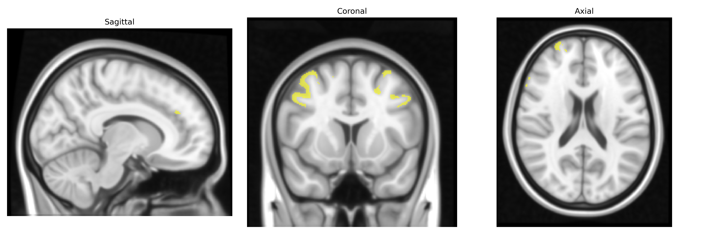
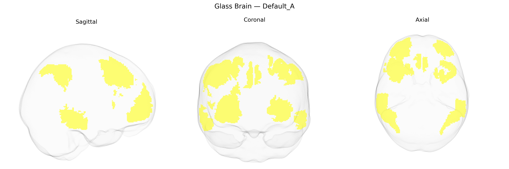

# Default_A
 
## Overview
 
The Bilateral Default_A region in the Yeo-17 functional atlas represents the core of the default mode network (DMN), encompassing midline and lateral association cortices that exhibit high metabolic activity at rest and reduced activity during externally focused, goal-directed tasks. This network typically includes the medial prefrontal cortex, posterior cingulate cortex/precuneus, and angular/inferior parietal regions, and is implicated in internally oriented cognition such as autobiographical memory, self-referential processing, mental simulation, and aspects of social cognition. Functionally, Default_A is thought to integrate information across time and modalities, supporting the construction of internal models of the world and the self, and is sensitive to alterations in various neuropsychiatric and neurodegenerative conditions. There is no direct Wikipedia article for the “Bilateral Default_A” label; a related structure is the [Default mode network](https://en.wikipedia.org/wiki/Default_mode_network).
 
The Bilateral Default_A network in the Yeo-17 atlas, a core component of the default mode network (DMN), has been implicated in several genetic and GWAS findings linking its structure and function to diverse traits and disorders. Large-scale imaging–genetics studies (e.g., UK Biobank–based GWAS) have identified common variants associated with DMN cortical thickness, surface area, and functional connectivity, often enriched near genes involved in synaptic function, neuronal migration, and neurodevelopment (including pathways involving glutamatergic signaling and axon guidance). Polygenic risk scores for schizophrenia, major depressive disorder, bipolar disorder, and autism spectrum disorder show associations with altered DMN connectivity or anatomy, with schizophrenia and major depression particularly linked to hypoconnectivity or structural reductions in medial prefrontal and posterior cingulate/precuneus portions of Default_A. Alzheimer’s disease GWAS loci (e.g., APOE, CLU, CR1, PICALM) have been repeatedly related to DMN vulnerability and amyloid deposition in Default_A hubs, and APOE ε4 status is associated with altered metabolism, connectivity, and atrophy in these regions. Additional GWAS and candidate-gene work has tied variation in DMN-related measures to cognitive performance, intelligence, conscientiousness, neuroticism, and risk for internalizing symptoms, indicating that Default_A serves as a genetically sensitive hub where common variants contributing to cognition and psychiatric and neurodegenerative risk converge.
 
*Overview generated by GPT-4o (2026).*
 
---
 
**Region ID:** 13  
**Hemisphere:** Bilateral  
**Atlas:** Yeo-17 
 
---
 
## Default_A – Black Background (Full Brain)
 

 
**Full Quality Version:** <a href="full_black.mp4" download>Download MP4</a>
 
---
 
## Default_A – White Background (Full Brain)
 

 
**Full Quality Version:** <a href="full_white.mp4" download>Download MP4</a>
 
---

## Triplanar View – T1 Background
 

 
---
 
## Triplanar View – Ghost Brain
 


