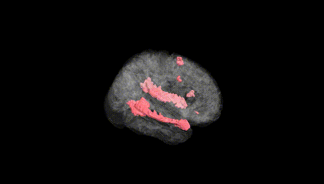
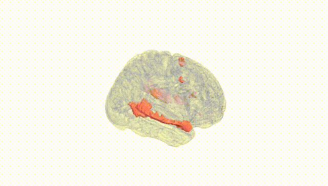
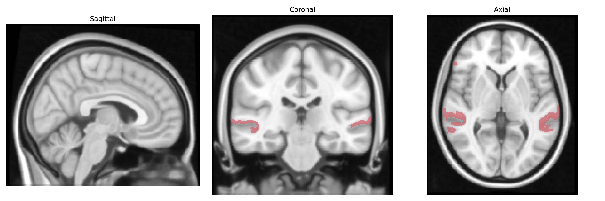
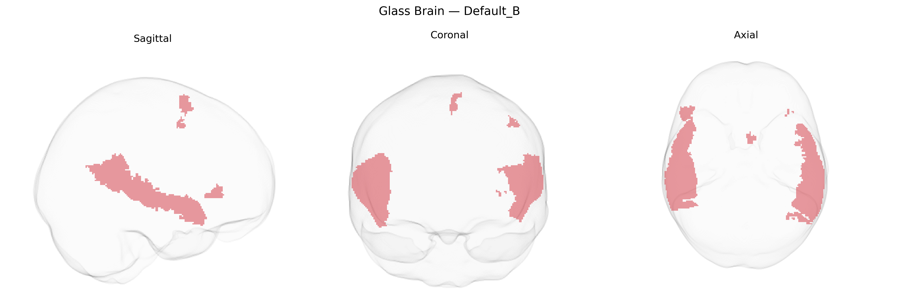

# Default_B
 
## Overview
 
The Bilateral Default_B region in the Yeo-17 atlas is a subdivision of the default mode network (DMN), typically encompassing midline and lateral association cortices such as portions of the medial prefrontal cortex, posterior cingulate/precuneus, and angular/inferior parietal areas. Functionally, this network is associated with internally directed cognition, including autobiographical memory, self-referential processing, mentalizing about others, and aspects of mind-wandering and spontaneous thought. Activity in Default_B often shows anticorrelation with task-positive networks during externally focused, attention-demanding tasks, reflecting a shift between internal and external modes of information processing. There is no direct Wikipedia article for “Bilateral Default_B,” but it is part of the [Default mode network](https://en.wikipedia.org/wiki/Default_mode_network).
 
The Bilateral Default_B region of the Yeo-17 atlas, part of the core/default mode network (DMN) including medial prefrontal, posterior cingulate/precuneus, and angular regions, has been implicated in multiple imaging genetics and GWAS studies that treat DMN connectivity and structure as heritable endophenotypes. Large-scale brain-imaging GWAS (e.g., UK Biobank–based studies) have identified common variants in genes related to synaptic function, neuronal development, and myelination (such as variants near APOE, MAPT, and several glutamatergic and GABAergic pathway genes) that associate with DMN connectivity, cortical thickness, and surface area in medial prefrontal and posterior cingulate areas. Polygenic risk for Alzheimer’s disease, schizophrenia, major depressive disorder, and autism spectrum disorder has been linked to altered DMN connectivity and activity, with APOE ε4 carrier status in particular associated with disrupted posterior DMN function and accelerated age-related changes in these regions. GWAS of cognitive traits (general intelligence, memory, educational attainment, mind-wandering propensity) also show that polygenic scores correlate with structural and functional measures in DMN hubs, suggesting shared genetic architecture between cognitive performance and Default_B network organization. However, most findings are at the level of distributed DMN or association cortex rather than uniquely specific to Default_B parcels, and the genetic associations are generally polygenic and small in effect, reflecting broad, shared genetic influences on large-scale association networks rather than region-exclusive genetic determinants.
 
*Overview generated by GPT-4o (2026).*
 
---
 
**Region ID:** 14  
**Hemisphere:** Bilateral  
**Atlas:** Yeo-17 
 
---
 
## Default_B – Black Background (Full Brain)
 

 
**Full Quality Version:** <a href="full_black.mp4" download>Download MP4</a>
 
---
 
## Default_B – White Background (Full Brain)
 

 
**Full Quality Version:** <a href="full_white.mp4" download>Download MP4</a>
 
---

## Triplanar View – T1 Background
 

 
---
 
## Triplanar View – Ghost Brain
 


